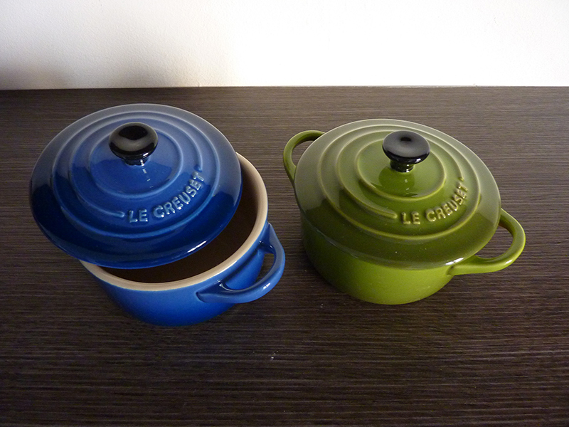

# Moldes y utensilios

| Foto | Nombre | Detalles |
| :--- | :--- | :--- |
| `pendiente` | Ablandador de masas | Marca: Kitchen Craft |
| 

| Bandeja para cupcakes o muffins | Marca: Wilton - Capacidad: 12 huecos de 5cm de base |
| `pendiente` | Boquillas para manga pastelera | Marca: Wilton - Modelos: 1M, 2D y 6B  |
|  | Cuchara de helados | Marca: Kitchen Craft - Diámetro: 49 mm  |
| `pendiente` | Gofrera | Marca: Nordic Ware - Medidas: 18.4 x 18.4 cm |
|  | Jarra medidora | Marca: OXO - Capacidad: 2 cups, 500 ml, 16 oz |
|  | Juego de cucharas medidoras | Marca: Ikea - Medidas: 100 ml, 15 ml (1 tablespoon), 5 ml (1 teaspoon), 1 ml |
|  | Juego de cucharas medidoras | Marca: Kitchen Craft - Medidas: 15 ml (1 tablespoon), 7.5 ml (1/2 tablespoon), 5 ml (1 teaspoon), 2.5 ml (1/2 teaspoon), 1.25 ml (1/4 teaspoon) |
|  | Juego de cucharas medidoras | Marca: Norpro - Medidas: 15 ml (1 tablespoon), 7.5 ml (1/2 tablespoon), 5 ml (1 teaspoon), 2.5 ml (1/2 teaspoon), 1.25 ml (1/4 teaspoon), 0.5 ml (1/8 teaspoon) |
|  | Juego de cucharas medidoras | Marca: Norpro - Medidas: 1 cup, 3/4 cup, 2/3 cup, 1/2 cup, 1/3 cup, 1/4 cup |
| `pendiente` | Molde cerámico acanalado | Marca: Emile Henry - Diámetro: 28 cm Altura: 5 cm |
|  | Mini- Cocottes de cerámica de gres | Marca: Le Creuset - Diámetro: 10 cm Capacidad: 0,2 L |
|  | Molde Bundt | Marca: Kaiser - Capacidad: 3 cups |
|  | Molde Bundt Classic Anniversary | Marca: Nordic Ware - Capacidad: 12 cups |
|  | Molde Bundt Kugelhopf | Marca: Nordic Ware - Capacidad: 10 cups Diámetro: 23 cm Altura: 13 cm |
| `pendiente` | Molde Bundtlette Anniversary | Marca: Nordic Ware - Capacidad: 5 cups |
|  | Molde cuadrado | Marca: Wilton - Medidas: 20 x 20 x 5 cm o 8 x 8 x 2 inches |
| `pendiente` | Molde layer cakes | Marca: Kitchen Craft Master Class - Diámetro: 15 cm |
|  | Molde loaf o de pan | Marca: Kitchen Craft Master Class - Medidas: 23 x 13 cm o 9 x 5 inches |
| `pendiente` | Molde rectangular | Marca:  Capacidad:  |
|  | Molde redondo acanalado desmoldable | Marca: Kaiser - Diámetro: 23 cm Altura 3 cm |
|  | Molde redondo desmoldable | Marca: Kitchen Craft Master Class - Diámetro: 23 cm Altura: 7 cm |
|  | Pistola de galletas | Marca: Ibili |
|  | Ramequines de cerámica | Marca: Ibili Diámetro: 9 cm Altura: 5 cm |
|  | Sellos para galletas *All Seasons* | Marca: Nordic Ware - Diámetro: 7.5 cm |
| `pendiente` | Soplete de cocina | Marca: Kitchen Craft Master Class |
| `pendiente` | Termómetro de cocina |  |
