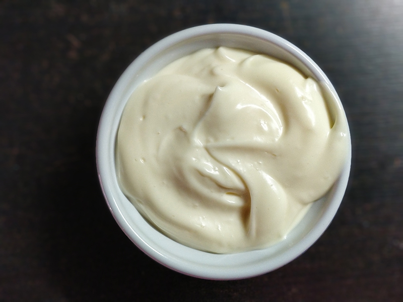

## Mayonesa

**Ingredientes**

- 1 huevo
- Una pizca de sal
- 200 ml de aceite de girasol
- Un poco de zumo de limón o vinagre

**Preparación**

En el vaso de la batidora ponemos el huevo, la pizca de sal y la mitad del aceite. Apoyamos el brazo de la batidora en el fondo y empezamos a batir, sin mover la batidora. Cuando empiece a tomar un poco de consistencia iremos moviendo la batidora arriba y abajo muy despacio y añadiendo poco a poco el resto del aceite. Añadimos el zumo de limón o el vinagre y terminamos de integrar.

**Notas**

De esta forma queda una mayonesa suave, si queremos más consistencia añadiremos más aceite.
Si se nos corta, podemos añadir otro huevo y empezar a batir lentamente como al principio.