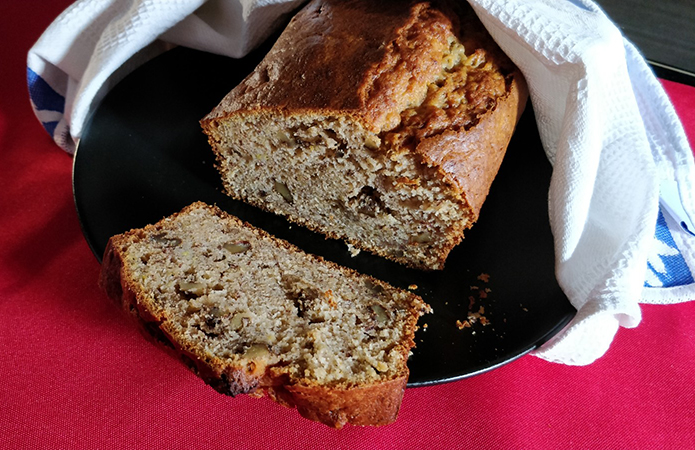

## Banana Bread - Pan de plátano - Otra versión

**Ingredientes**

- 3 plátanos medianos muy maduros
- 2 huevos M/L
- 150 g (3/4 cup) de azúcar blanco
- 120 ml (1/2 cup) de aceite de oliva suave
- 120 ml (1/2 cup) de buttermilk
- 1 teaspoon (5 ml) de extracto puro de vainilla
- 260 g (2 cups) de harina de trigo floja
- 1 teaspoon de canela molida
- 1 teaspoon de levadura química
- 1/2 teaspoon de bicarbonato sódico
- 1/4 teaspoon de sal
- 60 g (1/2 cup) de nueces trituradas

**Preparación**

Precalentamos el horno a 175 ºC, y preparamos el molde engrasándolo. Reservamos.

Machacamos los plátanos con un tenedor hasta dejarlos en puré. Reservamos.

En un bol tamizamos la harina, la canela, la levadura, el bicarbonato y la sal.

En otro bol grande batimos los huevos con el azúcar hasta obtener una mezcla esponjosa, con varillas de mano o la batidora de varillas. Añadimos el aceite poco a poco mientras seguimos mezclando, hasta obtener una textura suave. Añadimos el buttermilk y el extracto de vainilla hasta que quede bien combinado.
Añadimos la mezcla de ingredientes secos a los húmedos hasta que quede bien mezclado. Incorporamos el puré de plátano y mezclamos. Por último, añadimos las nueces, mezclándolas con una espátula de silicona lo justo hasta que queden bien repartidas por toda la masa. No mezclar en exceso porque haría que la masa quede demasiado densa y pesada.

Pasamos la mezcla al molde rápidamente, alisamos la superficie y damos unos golpecitos suavemente contra la encimera para eliminar las burbujas de aire que hayan podido quedar en el interior.

Llevamos al horno 55-60 minutos hasta que tenga un color dorado intenso y comprobemos antes de sacarlo que está hecho, pinchándolo con una brocheta o cake tester en el centro y que salga limpio.

Dejamos enfriar en el molde encima de una rejilla unos 10 minutos. Luego desmoldamos y dejamos sobre la rejilla hasta que se enfríe por completo.

**Notas**

Si no encontramos buttermilk podemos prepararlo casero utilizando una de estas opciones que nos explican en el blog de Pemberley Cup & Cakes:

*Para 1 cup (240 ml):*

*- 1 cucharada (15 ml) de zumo de limón o de vinagre de vino blanco o de sidra + 240 ml (1 cup) de leche*

*o*

*- 160 ml (2/3 cup) de yogur natural (desnatado) + 80 ml (1/3 cup) de leche
(mezclamos y dejamos reposar 10 minutos)*

Para esta receta yo utilicé la primera opción, pero tened en cuenta que se indica 1 cup (240 ml) y en la receta **solo necesitamos 1/2 cup (120 ml)**.

Podemos añadir un puñadito de chips de chocolate al mismo tiempo que las nueces.

Se conserva bien tapado a temperatura ambiente, pero podemos cortarlo en rebanadas y congelarlo bien envuelto en film por separado. Cuando lo queramos consumir podemos dejarlo descongelar a temperatura ambiente o darle un toque en el microondas.

**Molde utilizado:** [Molde loaf o de pan](../../moldes-y-utensilios.md)

**Receta de:** [Pemberley Cup & Cakes](http://pemberleycupandcakes.com/2013/09/18/banana-bread/)
