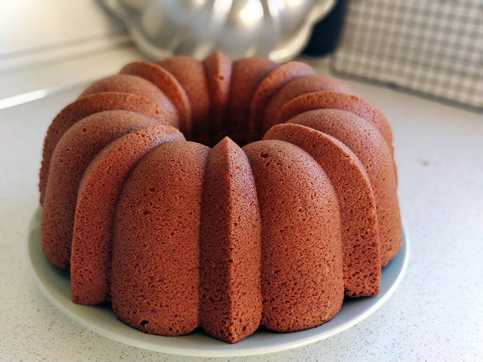

## Bizcocho de limón

**Ingredientes**

- Ralladura de un limón
- 3 vasos (375 g aprox.) de harina de trigo
- 1 sobre (16 g) de levadura química
- 3 huevos L
- Zumo de limón
- 2 vasos (410 g aprox.) de azúcar
- 1 vaso (250 ml) de leche
- 1 vaso (250 ml) de aceite de girasol o aceite de oliva suave

**Preparación**

Precalentamos el horno a 180º C, con calor por arriba y abajo. Ponemos una rejilla a una altura por debajo del centro del horno. Preparamos la ralladura de un limón.

Mezclamos la harina con la levadura y lo tamizamos. Reservamos. Separamos las yemas de las claras, reservando las yemas en un vaso. 

Con una batidora de varillas, montamos en un bol las claras a punto de nieve con un poco de zumo de limón, para que monten mejor. Vamos añadiendo las yemas, el azúcar, la leche, el aceite, la mezcla de harina y levadura (en varias tandas, mejor que todo de golpe) y por último la ralladura de limón. Añadimos cada cosa poco a poco, cuando la anterior se haya integrado bien.

Engrasamos un molde y los espolvoreamos con un poco de harina. Golpeamos suavemente para retirar el exceso. Vertemos en el molde toda la masa e introducimos al horno a 180º C, entre 45-50 minutos o hasta que al pincharlo con una varilla, ésta salga limpia. Sacamos el molde del horno y lo dejamos reposar 10 minutos sobre una rejilla antes de desmoldar. Desmoldar y dejar enfriar sobre la rejilla completamente.

**Notas**

El vaso que utilizo es de 250 ml.

La leche puede ser entera, semidesnatada o desnatada.

Para engrasar el molde y llegar a todos los rincones podemos mezclar 14 g de mantequilla derretida con 8 g de harina y pintar con una brocha todo el interior del molde.

Podemos conservar el bizcocho tapado con papel de aluminio e introducirlo en una bolsa, para que se mantenga tierno.

**Molde utilizado:** [Molde bundt de 12 cups o redondo con agujero de 26 cm de diámetro](../../moldes-y-utensilios.md)

**Receta de:** Mamá
