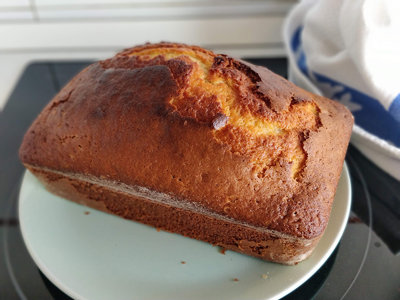
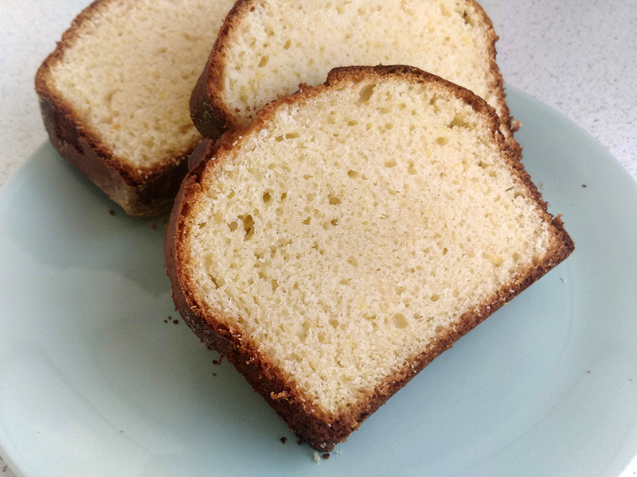

## Bizcocho de yogur - Otra versión

**Ingredientes**

- 2 tarritos de yogur natural 
- 3 huevos M
- 4 tarritos de harina de trigo de repostería o normal
- 2 tarritos de azúcar
- 3/4 de un tarrito de aceite suave (de girasol o de oliva)
- Un sobre (16 g) de levadura química
- 1 teaspoon de pasta de vainilla y la ralladura de un limón
- Una pizca de sal

*Para enharinar el molde*

- Aceite o mantequilla 
- Pan rallado o harina

**Preparación**

Precalentamos el horno a 180 ºC con calor por arriba y abajo. Preparamos el molde y reservamos.

En un bol grande ponemos todos los ingredientes juntos, batimos con la batidora de varillas o con la pala de la amasadora, primero a velocidad baja y después un minuto (más o menos) a velocidad alta. Sólo hasta que quede bien mezclado y tengamos una masa homogénea y sin grumos de harina. Pasamos la masa al molde que teníamos preparado, sin llegar al borde porque desbordaría, y llevamos al horno durante 45 minutos o 1 hora, aproximadamente, hasta que esté dorado y al pincharlo con una varilla ésta salga limpia.

Si pasado el tiempo aún no está listo, lo podemos cubrir con papel de aluminio para que no se queme, y dejarlo unos minutos más, pero controlado.

**Notas**

La medida del yogur es de 125 g.

Podemos utilizar el yogur que queramos, natural o de sabores, pero es aconsejable no utilizar desnatados. También podemos modificar los aromas a nuestro gusto.

**Molde utilizado: ** [Molde loaf o de pan](../../moldes-y-utensilios.md)

**Receta de:** [El restaurante del fin del mundo](http://restaurantefinmundo.blogspot.com/2015/05/guardianes-de-un-sabor-el-clasico.html)
