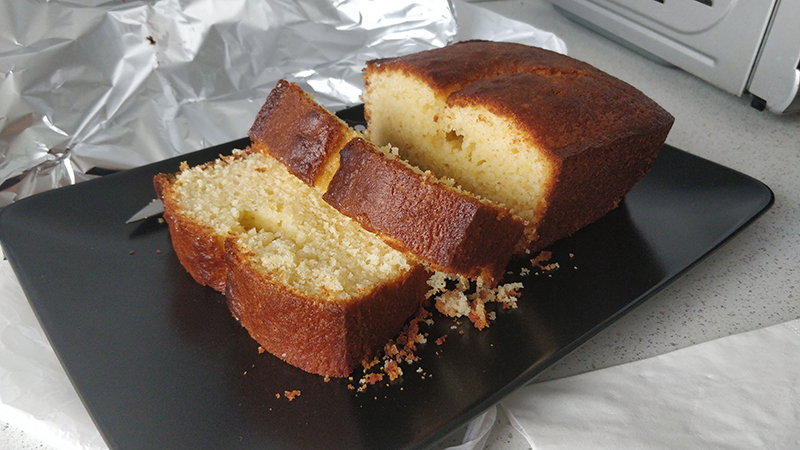

## Bizcocho de yogur

**Ingredientes**

- Ralladura de un limón
- 1 yogur de limón o natural
- 3 vasos de yogur de harina de trigo
- 1 teaspoon de levadura química
- 3 huevos M/L
- 2 vasos de yogur de azúcar
- 1 vaso de yogur de aceite de girasol o aceite de oliva suave

**Preparación**

Precalentamos el horno a 180º C, con calor por arriba y abajo. Ponemos una rejilla a una altura por debajo del centro del horno. Preparamos el molde engrasándolo con mantequilla o aceite y espolvoreándolo con harina. Golpeamos el molde suavemente para retirar el exceso. Reservamos.

Preparamos la ralladura de limón y reservamos. Sacamos el yogur de su envase, quitándole todo el suero posible, y lo reservamos. Lavamos y secamos bien el envase para utilizarlo como medida para el resto de ingredientes. Tamizamos la harina junto con la levadura y reservamos.

En un bol ponemos los huevos y el azúcar, y batimos con una batidora de varillas durante unos 5 minutos. Añadimos el yogur y continuamos batiendo unos segundos. Añadimos el aceite y seguimos batiendo unos segundos. Añadimos la ralladura de limón y la mezcla de harina y levadura, batiendo un poco con la batidora pero terminando de integrar con una espátula, recogiendo todo lo que haya quedado por los laterales del bol.

Pasamos la masa al molde que teníamos preparado y, si queremos, añadimos un poco de azúcar por encima para que se forme una costra crujiente. Llevamos al horno y dejamos unos 40-45 minutos, o hasta que al pincharlo con una varilla, ésta salga limpia. Si vemos que se nos está dorando mucho y aún está crudo podemos poner un trozo de papel de aluminio para evitar que se queme. 

Cuando esté hecho sacamos y dejamos templar sobre una rejilla. Desmoldamos y dejamos sobre la rejilla para que se enfríe completamente.

**Notas**

La medida del yogur es de 125 g.

Si no queremos que se forme la costra crujiente no añadiremos el azúcar. Lo podemos dejar tal cual o, al servirlo, añadir azúcar glas por encima con un colador.

Podemos conservar el bizcocho tapado con papel de aluminio y dentro de una bolsa, para que se mantenga tierno.

Podemos utilizar un yogur natural y añadir 1 teaspoon de extracto de vainilla, o la combinación de yogur-aroma que más nos guste.

Podemos espolvorear el molde con pan rallado en vez de con harina si nos gusta que quede el bizcocho un poco más crujiente por la parte de fuera.

**Molde utilizado:** [Molde loaf o de pan](../../moldes-y-utensilios.md)

**Receta de:** Mamá
