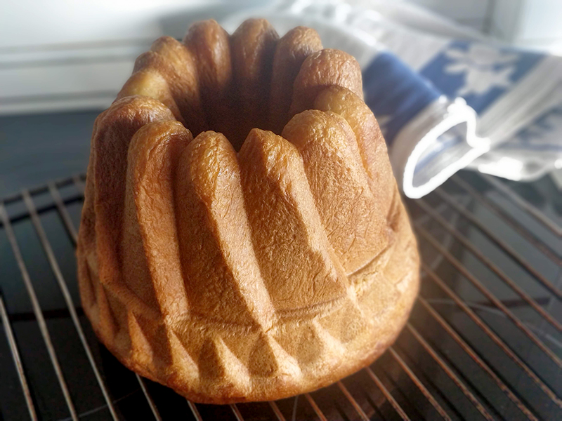

## Brioche de naranja

**Ingredientes**

- 500 g de harina de fuerza
- 10 g de sal
- 100 g de azúcar
- 150 g de huevo
- 130 ml de zumo de naranja
- 40 g de levadura fresca o 12 g de levadura seca de panadero
- Ralladura de 1 naranja
- 100 g de mantequilla

**Preparación**

Ponemos en el bol de la KitchenAid todos los ingredientes, excepto la mantequilla. Si utilizamos levadura fresca la desmenuzaremos antes de añadirla. Colocamos en la KitchenAid el accesorio de gancho y amasamos a velocidad 1 unos 10 minutos aproximadamente, hasta obtener una masa lisa.

En ese momento comenzamos a añadir la mantequilla poco a poco, sin añadir un trozo hasta que el anterior esté perfectamente integrado. Amasamos hasta obtener una masa lisa y elástica, que se despegue de las paredes del bol (unos 15 minutos aproximadamente).

Volcamos la masa sobre la encimera y le damos forma de bola. La volvemos a poner en el bol de la KitchenAid ligeramente engrasado y cubrimos con papel film. La dejamos levar en un lugar cálido y sin corrientes de aire hasta que doble su volumen (entre una hora y media y dos horas, dependiendo de la temperatura ambiente).

Cuando la masa haya doblado si volumen la volcamos sobre la encimera y, apretando suavemente con la yema de los dedos, la desgasificamos y la dejamos reposar 10 minutos para que se relaje, cubierta con un paño de cocina.

A continuación, le damos forma de bola y le hacemos un hueco en el centro con los dedos, dándole al hueco un tamaño suficiente como para que entre por la chimenea del molde bundt.

Engrasamos el molde con un spray antiadherente y dejamos escurrir boca abajo sobre un papel de cocina. 

A continuación colocamos la masa de brioche en el molde, cubrimos con papel film y dejamos reposar de nuevo hasta que la masa doble su volumen. Mientras, precalentamos el horno a 180 ºC, con calor arriba y abajo, y ponemos una rejilla en el centro o una altura por debajo.

Cuando la masa haya doblado su volumen, horneamos a 180 ºC durante unos 40 minutos. Pasado el tiempo sacamos el brioche y lo dejamos enfriar sobre una rejilla durante 10 minutos. Después desmoldamos y dejamos enfriar por completo sobre la rejilla.

**Notas**

En el enlace de la receta podéis ver cómo hacer naranja confitada para añadir trocitos a la masa y decorar el brioche. Si no os gusta no es necesario porque el sabor a naranja lo aporta el zumo y la ralladura.

También podemos añadir trocitos de chocolate negro a la masa, o algún fruto seco o uvas pasas.

Lo mejor es consumir el brioche en el día, pero lo podemos conservar en una bolsa con cierre hermético un día más. También lo podemos congelar bien envuelto en papel film. Para descongelarlo lo dejaremos a temperatura ambiente.

**Molde utilizado:** [molde Bundt Kugelhopf](../../moldes-y-utensilios.md)

**Receta de:** [Claudia & Julia](https://www.claudiaandjulia.com/blogs/general/brioche-de-naranja)