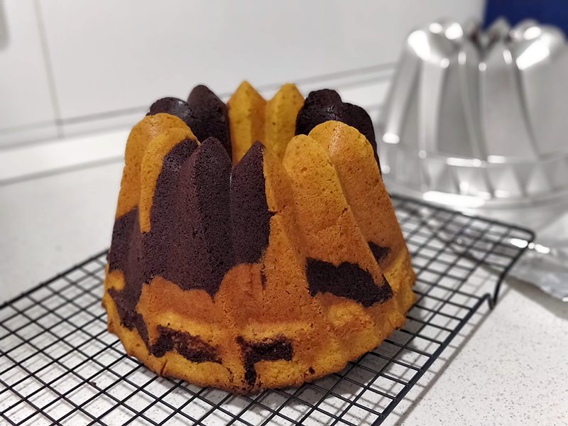

## Bundt Cake de calabaza y chocolate negro

**Ingredientes**

*Para la masa de chocolate*

- 170 g de mantequilla a temperatura ambiente
- 215 g de azúcar blanco
- 3 huevos M
- 130 g de harina de trigo
- 60 g de cacao puro en polvo sin azúcar
- 1 teaspoon de levadura química

*Para la masa de calabaza*

- 170 g de mantequilla a temperatura ambiente
- 215 g de azúcar blanco
- 3 huevos M
- 230 g de harina de trigo
- 1 teaspoon de levadura química
- 200 g de [puré de calabaza](../auxiliares/pure-de-calabaza-casero.md)
- *Opcional: 1/2 teaspoon de canela, una pizca de clavo y una pizca de nuez moscada*

**Preparación**

Precalentamos el horno a 180 ºC, con calor arriba y abajo.

Engrasamos un molde de bundt cake de 10 tazas.

Por un lado preparamos la masa de calabaza: batimos la mantequilla con el azúcar hasta que la mezcla esté cremosa y se aclare. Incorporamos el puré de calabaza, removemos bien. Añadimos los huevos, uno a uno, y cuando la mezcla sea homogénea, incorporamos la harina, tamizada con la levadura. Si os gusta, podéis echarle las especias opcionales en este punto. Mezclamos hasta tener una masa homogénea. Reservamos.

Por otro lado preparamos la masa de chocolate: batimos la mantequilla con el azúcar hasta que la mezcla esté cremosa y se aclare. Añadimos los huevos, uno a uno, y cuando la mezcla sea homogénea, incorporamos la harina, tamizada con la levadura y el cacao.

Echamos la mitad de la masa de calabaza en el molde, encima la masa de chocolate, después el resto de la de calabaza. Usando una cuchara o un palillo de brocheta, mezclamos ambas masas haciendo remolinos, con cuidado de no dañar el molde.

Horneamos durante 60 minutos o hasta que al introducir un palillo salga limpio.

Dejamos enfriar en el molde sin desmoldar 15 minutos. Una vez desmoldado lo dejamos enfriar sobre una rejilla.

**Notas**

Podemos preparar también una ganache de chocolate negro para rociar el bizcocho. Troceamos 150 g de chocolate negro y lo colocamos en un recipiente resistente al calor. Por otro lado calentamos 150 ml de nata 35% m.g. Cuando hierva, la vertemos sobre el chocolate negro y removemos con unas varillas hasta lograr una ganache brillante.

**Receta de:** [Objetivo: Cupcake perfecto](http://www.objetivocupcake.com/2016/10/bundt-de-calabaza-y-chocolate-negro.html)