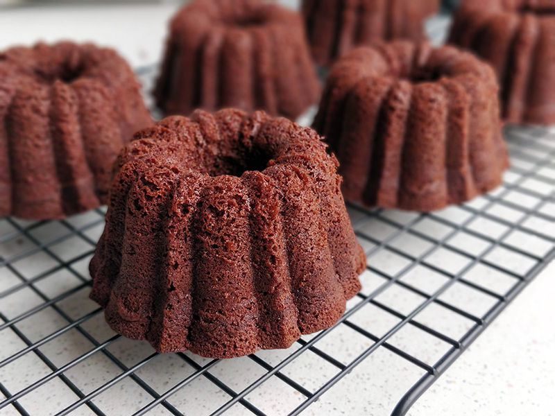

## Bundtlettes de chocolate

**Ingredientes**

- 180 g de mantequilla
- 250 g de azúcar extrafino
- 3 huevos L
- 1 teaspoon de café soluble
- 140 g de harina de trigo
- 50 g de cacao en polvo con proceso holandés (dutch process), como el de la marca Valor
- 1/4 teaspoon de levadura química
- 125 ml de buttermilk

**Preparación**

Precalentamos el horno a 175 ºC con calor arriba y abajo. Colocamos una rejilla en el centro o un poco por debajo. Engrasamos el molde con mantequilla derretida y espolvoreamos con harina, o utilizamos un spray desmoldante. Dejamos reposar boca abajo sobre un papel de cocina para que escurra el exceso.

Tamizamos la harina, el cacao en polvo, la levadura, el café y reservamos.

Batimos la mantequilla y el azúcar hasta conseguir una mezcla cremosa y que haya blanqueado. Añadimos los huevos uno a uno, ligeramente batidos, y mezclamos a velocidad baja. No agregaremos el siguiente hasta que el anterior no esté totalmente integrado. Añadimos la mezcla de la harina en tres veces, alternándola con el buttermilk y batiendo hasta que todo esté incorporado.

Llenamos las cavidades de la bandeja de bundtlettes que teníamos preparada hasta llenar 3/4 de su capacidad. Nos aseguramos de que la masa entre en todas las hendiduras del molde y que no queden espacios con aire, golpeando el molde suavemente y sobre un trapo de cocina bien acolchado.

Llevamos al horno unos 25-30 minutos o hasta que al pincharlos con una brocheta ésta salga completamente limpia.

Sacamos del horno y dejamos reposar la bandeja sobre una rejilla unos 10 minutos. Pasado el tiempo colocamos la rejilla sobre el molde y con cuidado le damos la vuelta para sacar los bundtlettes. Los dejamos enfriar sobre la rejilla.

**Notas**

El azúcar extrafino no es azúcar glas, es un azúcar que está entre el blanco normal y el glas, en cuanto al tamaño de los cristales de azúcar. Azucarera es una marca que lo comercializa.

Si no encontramos buttermilk podemos prepararlo vertiendo el zumo de medio limón (o 1 tablespoon de vinagre) sobre 125 ml de leche entera tibia. Sin remover, dejamos reposar unos 15-20 minutos, hasta que se corte y espese. Tendrá aspecto de leche cortada o yogur muy líquido, pero ésta es la textura que debe tener. Revolvemos cuando vayamos a usar, no es necesario colar.

También podemos utilizar un molde bundt de 6 cups o un molde loaf de unos 21 cm de largo.

**Molde utilizado:** [molde Bundtlette Anniversary](../../moldes-y-utensilios.md)

**Receta de:** [Libro Fiesta, de Bea Roque](https://www.claudiaandjulia.com/products/libro-fiesta-un-dulce-para-cada-ocasion)