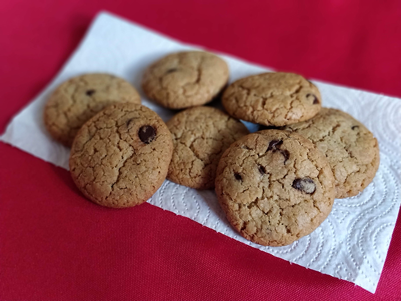

## Cookies con trocitos de chocolate y avena

**Ingredientes**

- 115 g de mantequilla a temperatura ambiente
- 100 g de azúcar
- 110 g de azúcar moreno oscuro
- 1/2 teaspoon de extracto de vainilla
- 1 huevo L
- 150 g de harina de trigo
- 1/4 teaspoon de sal
- 1/2 teaspoon de bicarbonato sódico
- 1/2 teaspoon de levadura química
- 110 g de avena pulverizada
- 125-170 g de gotas de chocolate, a gusto

**Preparación**

Precalentamos el horno a 200º C, con calor arriba y abajo.

Cremamos la mantequilla y añadimos el azúcar blanco y moreno, batiendo a mano o con una batidora de varillas. Añadimos el extracto de vainilla y el huevo, y lo batimos bien. 

En otro bol tamizamos la harina, la sal, el bicarbonato y la levadura. Incorporamos a la masa anterior, añadimos la avena pulverizada y unimos a mano con una espátula. Si nos cuesta un poco podemos continuar amasando con las manos. Por último, añadimos las gotas de chocolate. Damos un par de vueltas con las manos.

Formamos bolas con las manos y las colocamos en una bandeja de horno forrada con un papel de hornear, dejando unos 5 cm entre las bolas de masa.

Horneamos en el centro del horno, durante 10-15 minutos o hasta que estén doradas. Dejamos enfriar en una rejilla y listas para comer.

**Notas**

Las conservaremos en un bote hermético.

Obtendremos más o menos unas 30 galletas como las de las fotos.

**Receta de:** [Annie, Canal Cocina](https://canalcocina.es/receta/cookies-con-trocitos-chocolate)