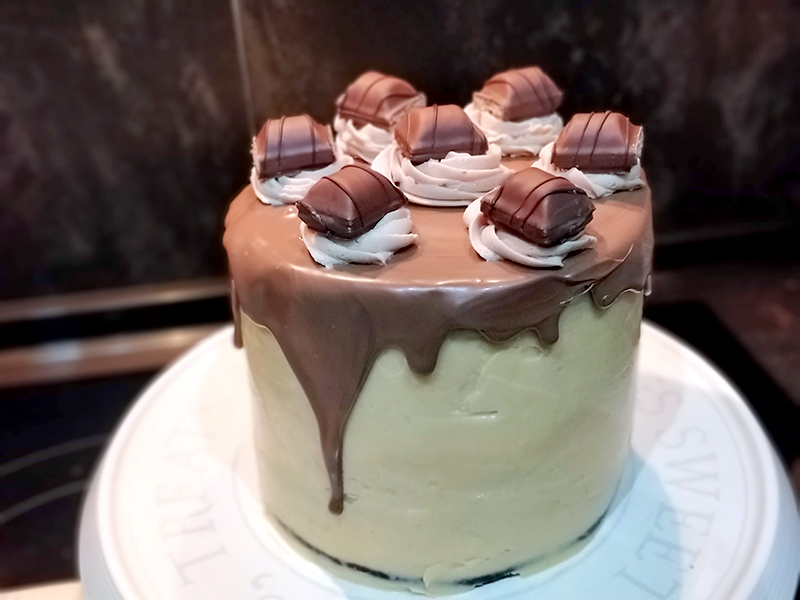
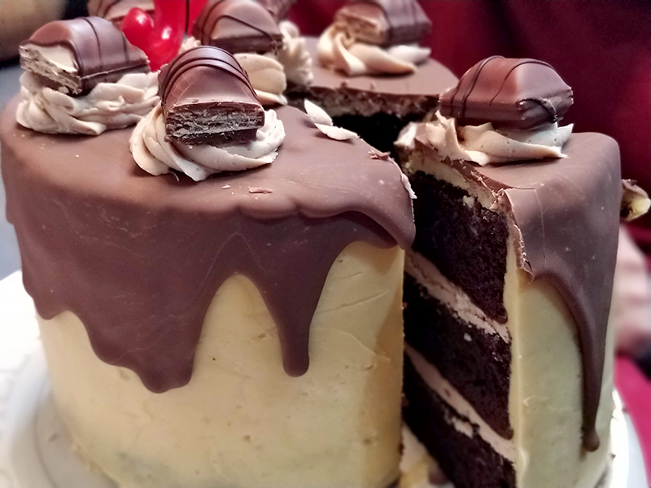

## Layer Caker de Kinder Bueno

**Ingredientes**

*Para el bizcocho de chocolate*

- 125 g de mantequilla sin sal a temperatura ambiente, pomada
- 280 g de azúcar
- 220 g de harina de trigo
- 60 g de cacao puro en polvo sin azúcar
- 1 teaspoon de levadura química
- 2 huevos M/L
- 190 ml de buttermilk que podemos preparar con 180 ml leche entera + 1 tablespoon de vinagre
- 1 teaspoon de pasta pura de vainilla
- 190 ml agua tíbia
- 1 y 1/2 teaspoons de bicarbonato sódico
- 1/2 teaspoon de sal

*Para el Buttercream de Kinder Chocolate para el relleno*

- 125 g de mantequilla sin sal a temperatura ambiente, pomada
- 150 g azúcar glas
- 100 g chocolate Kinder (8 chocolatinas)

*Para la crema de avellana italiana*

- 3 yemas de huevo M/L
- 42 ml agua
- 130 g azúcar
- 210 g mantequilla a temperatura ambiente, pomada
- 1 y 1/2 tablespoons de pasta de avellana italiana

*Para el montaje y decoración*

- 2 barritas de chocolate Kinder troceadas, una para cada capa intermedia
- 8 barritas de chocolate Kinder fundidas al microondas con unos 50 g de chocolate negro de repostería
- 4 barritas de Kinder Bueno

**Preparación**

*Para el bizcocho de chocolate*

Precalentamos el horno a 170 ºC, con calor arriba y abajo. Engrasamos los moldes y reservamos.

Preparamos la buttermilk y la dejamos reposar 15-10 minutos a temperatura ambiente. La leche se cortará y aparecerán grumos, pero es normal.

Tamizamos la harina, la levadura, el bicarbonato y la sal. Mezclamos y reservamos.

Cuando la mantequilla esté en punto pomada, la ponemos en un bol y con la batidora de varillas la mezclamos bien con el azúcar. Vamos aumentando la velocidad progresivamente hasta que esté bien integrado y la crema esté sedosa. Añadimos los huevos uno a uno, y asegurándonos de que se integran totalmente. Batimos a velocidad alta durante unos minutos para que la preparación gane volumen. Poco a poco, incorporamos el buttermilk y la pasta de vainilla. Seguimos batiendo. Bajamos la velocidad al mínimo e incorporamos la mitad de la mezcla de harina, removiendo lo justo hasta que esté integrado y no haya grumos. En ese momento añadimos el agua tibia (que habremos calentado un poquito en el microondas un momento antes) y el cacao en polvo. Seguimos mezclando a velocidad mínima, solo lo necesario. Por último, añadimos la otra mitad de la mezcla de harina, removemos suavemente y listo.

Pasamos la masa a los moldes, que no hay que llenarlos hasta arriba o desbordarán. Los llevamos al horno un mínimo de 60 minutos, a partir de entonces podemos probar si están hechos pinchando con una brocheta, si sale limpia y seca, el bizcocho estará listo. Los sacamos del horno y dejamos enfriar. Más tarde los desmoldamos y los dejamos enfriar completamente sobre una rejilla.

*Para el Buttercream de Kinder Chocolate para el relleno*

Tendremos la mantequilla a temperatura ambiente para que esté en punto pomada (blandita, no derretida). Tamizamos el azúcar glas, reservamos.

Derretimos las chocolatinas Kinder en el microondas o al baño María. Dejamos que enfríe a temperatura ambiente, removiendo con una cuchara o pala de madera.

Con los ingredientes listos, pasamos a preparar la buttercream. En un bol mezclamos la mantequilla con el azúcar glas. La mezcla se volverá blanquecina, sedosa y suave. Poco a poco vamos aumentando la velodad. Cuando el chocolate Kinder ya esté a temperatura ambiente lo añadimos y terminamos de integrar a velocidad alta. Reservamos.

*Para la crema de avellana italiana*

Cortamos la mantequilla fría a tiras finas y dejamos a temperatura ambiente hasta que esté pomada. Reservamos.

En un bol batimos las  yemas a velocidad media-alta. Poco a poco irán montando.

Por otro lado, preparamos un almíbar. En un cazo a fuego medio calentamos el azúcar y el agua. Si tenemos termómetro de azúcar, debemos dejarlo hasta que alcance los 120º C, si no tenemos, hasta que el azúcar esté bien disuelto y al ponernos una gotita en las manos no notemos grumos.

Ahora iremos vertiendo, poco a poco, en forma de hilo, el almíbar sobre las yemas de huevo montadas. Sin dejar de batir e intentando evitar que el almíbar toque las varillas de la batidora o quedará todo cristalizado. Batimos a velocidad alta, al menos 10 minutos más, hasta que la mezcla esté a temperatura ambiente.

A continuación bajamos un poco la velocidad para añadimos poco a poco la mantequilla pomada. Cuando esté toda incorporada subimos la velocidad al mázimo y esperamos a que todo quede bien integrado. En este momento añadimos la pasta de avellana italiana e integramos.

*Para el montaje y decoración*

Podemos preparar un almíbar para empapar un poco los bizcochos con 100 ml de agua y 100 g de azúcar, que pondremos a hervir hasta que se disuelva el azúcar. Pero no es necesario si nuestros bizcochos están muy tiernos.

Elegimos el plato o stand donde vamos a presentar la tarta y colocamos la primera capa de bizcocho. Con ayuda de una espátula o cuchillo sin sierra, extendemos buttercream de chocolate kinder hasta formar una capa. Añadimos una de las barritas de chocolate Kinder que teníamos reservadas, troceada. Repetir con la siguiente capa de bizcocho, capa de buttercream y barrita troceada. Colocar la última capa de bizcocho. El buttercream restante lo utilizaremos para la decoración final de la tarta.

Ahora pasamos a cubrir toda la tarta con una capa fina de crema de avellana italiana, intentando que quede lo más lisa posible. Esta primera capa fina dejará ver aún los bizcochos, pero no pasa nada, es así. Llevamos a la nevera unos 30 minutos.

Pasado el tiempo volvemos a extender una nueva capa de crema de avellana italiana, de nuevo intentando que quede lo más lisa posible. Y volvemos a dejar reposar en la nevera otros 30 minutos.

Repetimos una tercera vez y de nuevo, dejamos 30 minutos en la nevera.

Mientras, derretimos las barritas de chocolate Kinder junto con el chocolate de repostería en el microondas, con cuidado de que no se queme, hasta que tengamos un chocolate líquido. Dejamos q enfríe a temperatura ambiente mientras tenemos la tarta en la nevera.

Una vez saquemos la tarta, vertemos el chocolate derretido por toda la parte superior de la tarta, dejando que caiga un poco por los laterales (podemos ayudarnos de una cuchara para repartirlo bien). De nuevo, dejar la tarta en la nevera para que el chocolate endurezca.

Para terminar, ponemos el buttercream restante en una manga pastelera con una boquilla de estrella (por ejemplo la 1M de Wilton, pero podéis usar la que queráis) y hacemos unas pequeñas rosas en la parte superior de la tarta, y en cada una de ellas colocamos una porción de barrita de Kinder Bueno. Lista para servir.

**Molde utilizado:** [moldes de layer cake de 15 cm de diámetro](../../moldes-y-utensilios.md).

**Receta de:** [Cookcakes de Ainhona](http://cookcakesdeainhoa.blogspot.com/2015/03/1r-cumple-blog-layer-cake-chocolate.html), [Jarita's Cookies](http://jaritascookies.blogspot.com/2017/04/layer-cake-kinder-bueno.html) y [Objetivo: Cupcake perfecto](http://www.objetivocupcake.com/2013/12/cupcakes-de-kinder-bueno.html)