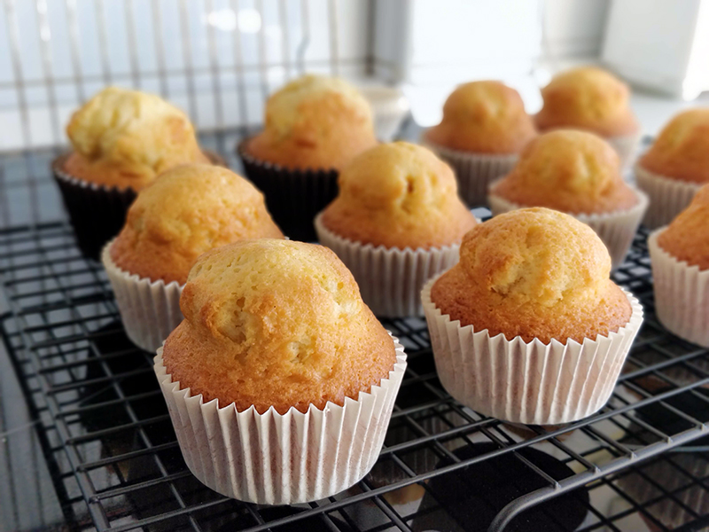

## Magdalenas - Otra versión

**Ingredientes**

- 180 ml de aceite de oliva suave o virgen extra
- 180 g de azúcar
- 3 huevos M
- 50 ml de nata (35% m.g.)
- 200 g de harina de trigo
- 1 y 1/2 teaspoons de levadura química
- Ralladura de limón

**Preparación**

Mi intención es hacerlas con copete alto, por lo que prepararé la masa y la dejaré reposar hasta el día siguiente.

En un bol mezclamos a mano con un batidor de varillas el azúcar con el aceite. Cuando esté bien mezclado añadimos los huevos y seguimos mezclando. Una vez bien incorporado, añadimos la mitad de la harina mezclada con la levadura, tamizándolas. Reservamos el resto. Batimos la masa hasta que se haya integrado. Incorporamos la mitad de la nata, batimos, añadimos el resto de la mezcla de harina, tamizando igual que antes, batimos, y añadimos el resto de la nata. Por último, añadimos la rayadura de limón.

Una vez la masa está lista, la dejamos reposar al menos una hora, o de un día para otro.

Al día siguiente, precalentamos el horno a 220 ºC, con calor arriba y abajo. Preparamos las cápsulas apra magdalenas en la bandeja para muffins. Sacamos la masa del frigorífico, la removemos un poco y la repartimos en las cápsulas hasta llenarlas unos 3/4 de capacidad. Llevamos al horno colocándola un nivel por debajo del centro, en la bandeja del horno, bajamos la temperatura a 200 ºC y dejamos unos 15 min o hasta que estén doradas y al pincharlas con un palillo en el centro, éste salga limpio.

Dejamos enfriar sobre una rejilla y servimos.

**Notas**

Para 10-12 magdalenas.

Si utilizas cápsulas de papel y no tienes bandeja para magdalenas puedes meter las cápsulas en moldes de aluminio desechables o usar cápsulas de silicona rígidas. En ningún caso hornees las magdalenas en cápsulas de papel blandas, sin sujección a los lados porque se abrirán hacia los lados y la masa podría desbordar.

Podemos usar otros aromas como vainilla, naranja, frutos secos picados, chips de chocolate, etc.

**Molde utilizado:** [bandeja para muffins](../../moldes-y-utensilios.md)

**Receta de:** [Alma Obregón](https://www.youtube.com/watch?v=CJqOg2r6Z-A)(vídeo)
