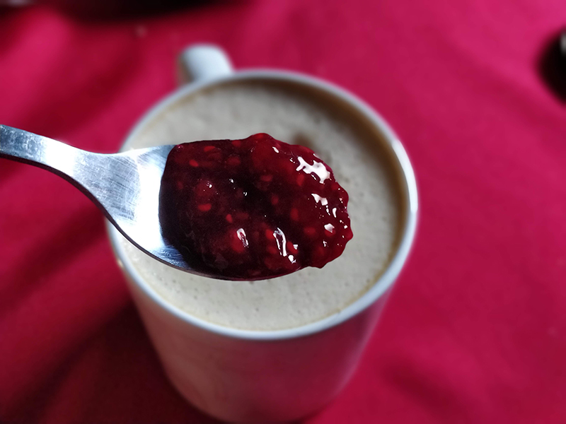

## Mermelada de frambuesas

**Ingredientes**

- 400 g de frambuesas
- 175 g de azúcar
- Medio vaso de agua

**Preparación**

Empezaremos preparando unos botes esterilizados para guardar la mermelada más tarde.

En una olla grande colocamos los botes que vamos a usar boca arriba y las tapas por separado. Llenamos la olla de agua hasta que hayamos cubierto los botes. Calentamos el agua hasta que hierva y dejamos hervir durante 30 minutos, con los botes dentro. Dejamos enfriar dentro del agua y ya tenemos los botes listos para rellenarlos.

Una vez tenemos los botes esterilizados, empezamos con la preparación de la mermelada.

Lavamos bien las frambuesas y las ponemos en una cacerola amplia junto con el agua. Calentamos a fuego medio. Cuando empiece a hervir contamos 40 minutos, removiendo de vez en cuando, cada diez minutos más o menos.

Pasado el tiempo, añadimos el azúcar y seguimos removiendo de forma constante durante unos 10 minutos.

Con la mermelada lista la distribuimos en los botes esterilizados que tengamos preparados para ella. Los llenamos hasta arriba y los cerramos bien.

Realizamos una segunda esterilización. Cocemos los botes durante 20 minutos a fuego lento en agua. Pasado el tiempo, sacamos los botes y los colocamos boca abajo sobre un paño durante toda la noche. Pasadas unas 24 horas y cuando ya se haya enfriado, guardamos los botes en un lugar fresco, alejado de la luz solar.

**Notas**

Normalmente, cuando se hace más cantidad (como en la receta original) se suele utilizar pectina de manzana. La podéis encontrar en tiendas de repostería. No es obligatorio su uso, pero ayudará a que la mermelada espese un poco más, a que tenga mayor brillo y no añade sabor.

En la receta original mezcla frambuesas, cerezas y fresas para una mermelada de frutos rojos.

Es importante que llenemos los botes el borde de lo que queramos llenarlos: mermelada, conservas (aceite, escabeche...).

**Receta de:** [Jaleo en la cocina](http://www.jaleoenlacocina.com/2016/06/mermelada-de-frutos-rojos-como-estirilizar-botes.html)