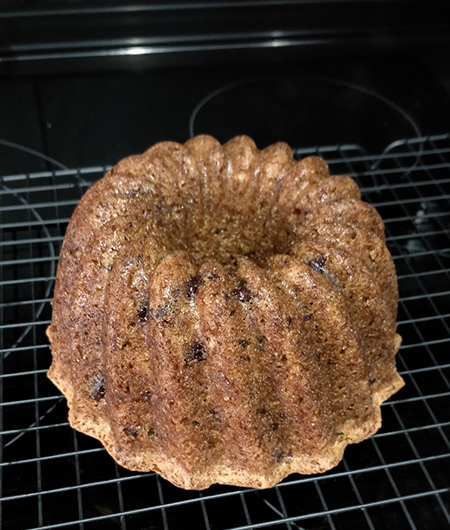

## Mini Banana Bundt Cake - Bundt Cake de plátano, versión mini

**Ingredientes**

- 3/4 cup (97 g) de harina de trigo
- 1/2 teaspoon de bicarbonato sódico
- 1/8 teaspoon de sal
- 1/4 cup (56 g) de mantequilla
- 1/2 cup (100 g) de azúcar blanco
- 1 huevo M (50 g)
- 1/2 teaspoon de extracto natural de vainilla
- 1/4 cup (56 g) de plátano maduro machacado
- 1/4 cup (56 g) de yogur griego
- 50 g de chips de chocolate (opcional)

**Preparación**

Tener el huevo, el yogur griego y la mantequilla a temperatura ambiente.

Precalentamos el horno a 175º C y colocamos la rejilla en el centro del horno. Engrasamos el molde bundt meticulosamente con mantequilla. Enharinamos retirando el exceso dando unos golpecitos suaves. Reservar.

En un bol tamizamos la harina, el bicarbonato y la sal. Reservar.

En otro bol batimos con una batidora de varillas a velocidad media-alta la mantequilla con el azúcar hasta que quede una mezcla blanquecina, ligera y esponjosa, 3-5 minutos. Añadimos el huevo y el extracto de vainilla y batimos hasta que quede bien incorporado.

Añadimos un tercio de la harina mientras seguimos batiendo a velocidad baja y, sucesivamente, el plátano machacado, otro tercio de la harina, el yogur griego y el último tercio de la harina. Nos aseguramos bien de recoger toda la masa que haya en los laterales del bol empujándola hacia abajo con una espátula. Añadimos los chips de chocolate y, con la espátula, las distribuimos bien por toda la masa.

Rellenamos el molde, alisamos la superficie y golpeamos varias veces el molde contra la mesa de trabajo, sobre un paño de cocina para no dañar el molde, para eliminar posibles bolsas de aire.

Horneamos a 175º C durante 25-30 minutos o hasta que al insertar un palillo en el centro del bizcocho, éste salga limpio. Sacamos el molde del horno y lo dejamos reposar 10 minutos sobre una rejilla antes de desmoldar. Desmoldamos y dejamos enfriar sobre la rejilla.

**Notas**

Si os gusta la combinación de canela y plátano podéis añadir 1/2 teaspoon de canela a la masa. Tamizarla junto a la harina.

Los chips de chocolate son opcionales, los podemos omitir o sustituir por nueces picadas.

Para engrasar el molde y llegar a todos los rincones podemos mezclar 14 g de mantequilla derretida con 8 g de harina y pintar con una brocha todo el interior del molde.

Las cantidades de la receta están ajustadas para usar un molde pequeño de bundt de 3 cups. Si tenemos un molde tradicional, de unos 12 cups, solo tenemos que multiplicar por cuatro los ingredientes y tenerlo más tiempo en el horno, unos 50-60 minutos.

**Molde utilizado:** [molde bundt de 3 cups](../../moldes-y-utensilios.md)

**Receta de:** DeNIKAtessen