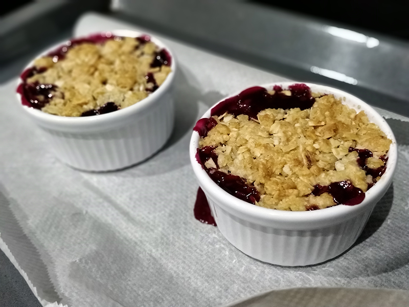

## Mini Cherry Crisp

**Ingredientes**

*Para la cobertura*

- 32 g (1/4 cup) de harina de trigo normal
- 25 g (1/4 cup) de copos de avena rápidos
- 2 tablespoons (25 g) de azúcar blanco
- 2 tablespoons (25 g) de azúcar moreno claro
- 1/8 teaspoon de sal
- 3 tablespoons (42 g) de mantequilla fría
- 20 g (1/4 cup) de almendras fileteadas

*Para el relleno*

- 400 g de cerezas deshuesadas
- 2 tablespoons (25 g) de azúcar vainillado
- 2 teaspoons de harina fina de maíz
- 2 teaspoons de licor de almendras (opcional)

**Preparación**

Precalentamos el horno a 175º C, con calor por arriba y abajo. Engrasamos 4 ramequines y los ponemos sobre la bandeja del horno. Reservamos.

Preparamos la cobertura. En un bol mezclamos la harina, los copos de avena, los dos tipos de azúcar y la sal. Añadimos la mantequilla fría cortada en dados y, con un ablandador de masas o con las puntas de los dedos, mezclamos la mantequilla hasta que tenga un aspecto de migas de pan. Añadimos las almendras, mezclamos para que queden bien repartidas y refrigeramos mientras preparamos el relleno.

Para el relleno, mezclamos en un bol las cerezas deshuesadas, el azúcar vainillado, la harina de maíz y el licor de almendras (si lo usamos). Repartimos la mezcla entre los cuatro ramequines y cubrimos con la cobertura que teníamos reservada.

Horneamos a 175º C durante 25-30 minutos o hasta que la cobertura esté dorada y burbujeen los jugos de la fruta.

Podemos servir templado o a temperatura ambiente, acompañado de nata montada o helado de vainilla.

**Notas**

Con estas cantidades podemos hacer 4 unidades.

Si no tenéis copos de avena rápidos, se pueden utilizar los tradicionales pero primero los pasaremos por el cuchillo para hacerlos más pequeños.

Se puede sustituir el licor de almendra por extracto natural de almendra (pondremos entre 1/4 y 1/2 teaspoon) o extracto natural de vainilla (pondremos 1/2 teaspoon).

Si las cerezas no son muy dulces podemos añadir 1 o 2 tablespoon de azúcar más para compensarlo.

Cuando pongamos el relleno en los moldes hay que compactarlo bien ya que al hornear se encogerá.

Se puede hacer una versión mayor en un molde cuadrado de 20 cm, doblando las cantidades y horneando 10-15 minutos más.

Es importante poner los moldes sobre la bandeja y no sobre la rejilla, de manera que si los jugos de la fruta se salen, no manchen el horno.

**Molde utilizado:** [ramequines de cerámica](../../moldes-y-utensilios.md)

**Receta de:** DeNIKAtessen