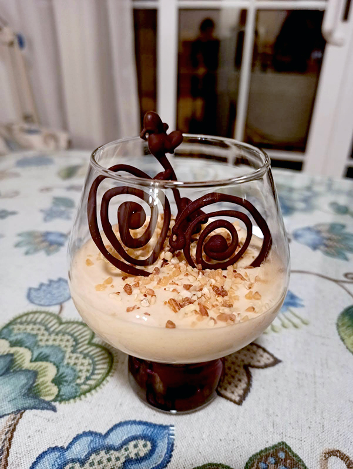

## Mousse de turrón blando

**Ingredientes**

- 200 g de turrón blando
- 200 ml de nata para montar (35% M.G.)
- 150 ml de leche entera
- 1 huevo L
- 2 láminas de gelatina
- 15 g de azúcar glas
- Una pizca de sal
- Chocolate para postres para decorar
- Almendra crocanti para decorar

**Preparación**

Hay que realizar 4 elaboraciones diferentes por separado y al final mezclarlas de forma adecuada.

Empezamos montando a punto de nieve la clara de huevo con la batidora de varillas. Podemos añadirle unas gotas de limón para que monten mejor. Batimos hasta que tenga una textura firme, y al darle la vuelta al bol, no caiga. Reservamos.

Por otro lado, montamos la nata. Lo mejor es tenerla en la nevera hasta el último momento, para que esté bien fría. También es recomendable que el bol que vayamos a utilizar sea de cristal o metálico, y que junto con las varillas, lo dejemos en el frigorífico o congelador, para que estén muy fríos.

Montamos la nata con la batidora de varillas hasta que la veamos esponjosa y espesa, puede tardar entre 5 y 10 minutos aproximadamente. Pero, cuidado, no hay que pasarse de batido o pasaremos a tener mantequilla. Reservamos en la nevera.

En un bol ponemos las hojas de gelatina y cubrimos con agua fría, para hidratarlas. Reservamos.

En otro bol ponemos la yema de huevo junto con el azúcar glas, y con unas varillas de mano batimos hasta que quede cremoso y de un color amarillo claro. Reservamos.

Trituramos el turrón blando con la leche, con una batidora de vaso o con una de brazo o un robot, lo que tengáis. Ponemos la mitad de esta mezcla en un cazo, y lo ponemos a fuego medio. Cuando empiece a borbotear, escurrimos la gelatina con las manos para quitar el agua y la añadimos al cazo. Removemos con unas varillas, apartamos del fuego y añadimos la otra mitad del batido de turrón y leche.

Una vez tenemos las cuatro preparaciones y la de turrón está fría o a temperatura ambiente, pasamos a hacer la mezcla completa.

En un bol grande ponemos la mezcla de turrón, leche y gelatina y añadimos la mezcla de yemma con azúcar. Mezclamos bien. Sacamos la nata de la nevera y la añadimos en varias tandas, con movimientos envolventes mezclando poco a poco, con unas varillas manuales. Poco a poco se terminará integrando.

Por último, incorporamos de la misma forma la clara de huevo montada, con movimientos envolventes y las varillas de mano, poco a poco.

Una vez tenemos la mezcla, la repartiremos en los recipientes que vayamos a usar. Podemos usar una cuchara o una manga pastelera, lo que nos resulte más cómodo, pero intentando no ensuciar los bordes del recipiente.

Los dejaremos enfriar en la nevera un mínimo de 4 horas, aunque es mejor dejarlos reposar de un día para otro.

Para la decoración, podemos derretir chocolate para postres, al baño María o con mucho cuidado en el microondas, en tandas de 30 segundos o menos, hasta que prácticamente esté derretido. Pasamos el chocolate a un biberón o similar y dibujamos las formas que queramos, sobre una bandeja forrada con papel de horno, que luego dejaremos en la nevera para que enfríe bien y el chocolate vuelva a ponerse duro.

En el momento de servir, decoramos la mousse con almendra crocanti y figuras de chocolate. O con un poco de turrón blando rallado. 

**Notas**

Con estas cantidades pueden salir unas 6 raciones individuales.

Podemos usar chocolate negro o blanco o ambos para decorar.

**Receta de:** [Recetas de escándalo](https://www.recetasdeescandalo.com/mousse-de-turron-blando-deliciosa-y-esponjosa/)