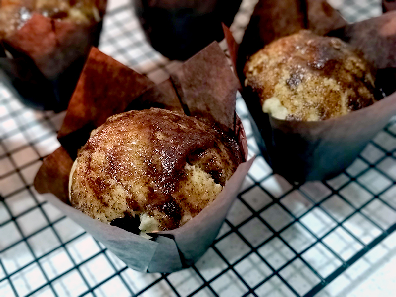

## Muffins de canela y nuez moscada

**Ingredientes**

- 1 y 3/4 cups de harina de trigo
- 1 y 1/2 teaspoon de levadura química
- 1/2 teaspoon de sal
- 1/4 teaspoon de nuez moscada
- 3/4 teaspoons de canela
- 1/4 cup de aceite de oliva suave o girasol
- 2/3 cup de azúcar blanco
- 1 huevo M/L
- 1 cup de leche entera

*Para la cobertura*

- 1/4 cup (55-60 g) de mantequilla derretida
- 1/2 cup de azúcar blanco
- 1 tablespoon de canela

**Preparación**

Precalentamos el horno a 180 ºC con calor arriba y abajo. Ponemos una bandeja en el centro del horno o una altura por debajo. Preparamos la bandeja para muffins con los papelitos y reservamos.

Por un lado mezclamos en un bol la harina, la levadura, la sal, la nuez moscada y la canela. Simplemente revolvemos para que se repartan.

Por otro mezclamos en otro bol el aceite, el azúcar, el huevo y la leche. Batimos a mano con unas varillas hasta que estén mezclados. Añadimos a esta mezcla la de harina, e integramos lo justo hasta que sea una masa uniforme.

Pasamos la masa a los moldes de muffins con una cuchara para helados o como nos sea más fácil. Llevamos al horno unos 15-18 minutos, o hasta que al pincharlos con una brocheta ésta salga limpia. Sacamos del horno y dejamos enfriar sobre una rejilla.

Mientras, podemos preparar la cobertura. Derretimos la mantequilla en un bol y en otro tazón o plato mezclamos el azúcar con la canela. Pasamos cada muffin primero por la mantequilla y luego por la canela y azúcar, girando bien para cubrir todos los lados. Dejamos enfriar unos minutos para que la mantequilla y el azúcar se endurezcan ligeramente antes de servir.

**Notas**

Si nos gustan las muffins grandotas pueden salirnos unas 7 muffins.

Cuando ya estaban hechos a mí me quedaron bastante blanquitos. Pero luego con la cobertura se disimula.

En mi caso iba a manchar (o estropear) el papel de las muffins si las metía directamente en la mantequilla de la cobertura, así que lo mezclé todo y luego con una brocha o una cuchara fui repartiendo por encima de cada muffin la cobertura.

**Molde utilizado:** [bandeja para cupcakes o muffins](../../moldes-y-utensilios.md)

**Receta de:** María NC