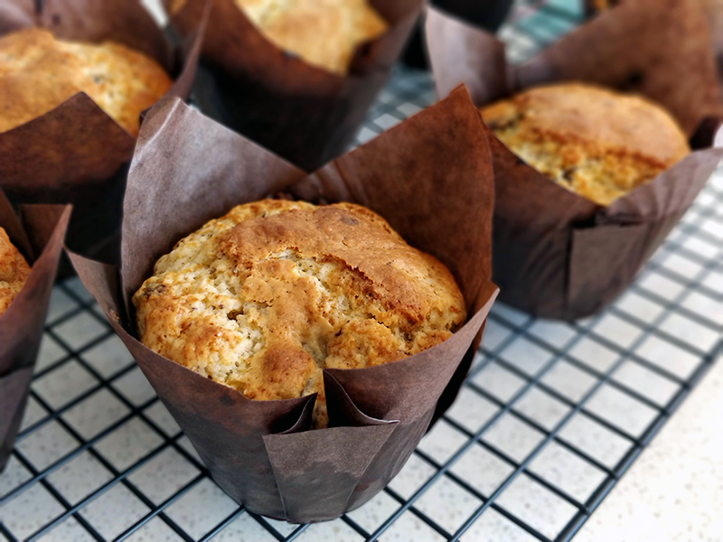

## Muffins con trozos de chocolate

**Ingredientes**

- 84 g de mantequilla, a temperatura ambiente
- 3/4 cup de azúcar blanco
- 1 huevo M/L, a temperatura ambiente
- 3/4 cup de yogur griego, a temperatura ambiente
- 2 teaspoons de pasta o extracto de vainilla
- 1 y 1/2 cups de harina de trigo
- 1 y 1/2 teaspoons de levadura química
- 1/2 teaspoon de bicarbonato sódico
- 3/4 teaspoon de sal
- 140 g de chocolate negro en trozos

**Preparación**

Precalentamos el horno a 220 ºC, con calor arriba y abajo y una bandeja una altura por debajo del centro. Preparamos la bandeja para muffins con los papelitos y reservamos.

En el bol de la amasadora, con el accesorio de pala, batimos la mantequilla y el azúcar a velocidad alta, hasta que esté suave y esponjoso, aproximadamente durante unos 3 minutos. Cumplir el tiempo completo, ayudará a que suban mejor en el horno. Añadimos el huevo y batimos 1 minuto más. Añadimos el yogur griego y seguido la pasta de vainilla, y batimos hasta que se integre todo.

En otro bol, mezclamos la harina, la levadura, el bicarbonato y la sal. Removemos un poco para mezclar e integramos a los ingredientes húmedos, poco a poco para evitar que todo se llene de harina. Mezclamos hasta que comience a integrarse, pero no del todo. Paramos la amasadora y, por último, añadimos los trozos de chocolate e incorporamos a mano con una espátula. Mezclar lo justo para que se integre. La masa debe estar espesa.

Con ayuda de una cuchara para helados o como nos sea más fácil, vamos llenando los papelitos de muffins con la masa a nuestro gusto. Llevamos al horno, que estará a 220 ºC durante unos 5 minutos. Luego bajamos la temperatura a 190 ºC y horneamos 15 minutos más, hasta que estén dorados y al pincharlos con un palillo estén hechos. Retiramos del horno y dejamos enfriar sobre una rejilla.

**Notas**

Salen unas 7-9 muffins, dependiendo del tamaño del que las hagamos.

**Molde utilizado:** [bandeja para cupcakes o muffins](../../moldes-y-utensilios.md)

**Receta de:** [Broma Bakery](http://bromabakery.com/2016/01/chocolate-chunk-muffins-recipe.html)
