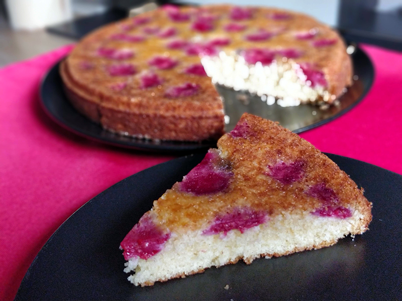

## Raspberry Buttermilk Cake

**Ingredientes**

1 cup (130 g) de harina de trigo
1/2 teaspoon (2 g) de levadura química
1/2 teaspoon (2 g) de bicarbonato sódico
1/4 teaspoon de sal
56 g de mantequilla sin sal, ablandada
2/3 cup (146 g) más 1 y 1/2 tablespoons (22 g) de azúcar, por separado
1/2 teaspoon extracto o pasta pura de vainilla
1/2 teaspoon de ralladura de limón, opcional
1 large (57 g) egg
1/2 cup (118 ml) buttermilk
1 cup (5 ounces or 140 g) frambuesas frescas

**Preparación**

Precalentamos el horno a 200 ºC, con calor arriba y abajo, con una rejilla en el centro del horno. Preparamos el molde engrasándolo y enharinándolo. Reservamos.

En un bol mezclamos la harina, la levadura, el bicarbonato y la sal, y reservamos. En otro bol batimos la mantequilla con los 146 g de azúcar con una batidora de varillas, a velocidad media-alta, hasta que se ponga de un color más claro y tenga una textura esponjosa. Añadimos la vainilla y la ralladura de limón, si la usamos, e integramos bien.

A baja velocidad, añadimos la mezcla de la harina en tres tandas, alternando con el buttermilk, empezando y terminando con la harina. Batir bien hasta que se mezclen. Volcamos la masa en el molde, alisando la superficie. Distribuimos las frambuesas por encima a nuestro gusto y espolvoreamos con el resto del azúcar que teníamos reservados (los 22 g).

Llevamos al horno hasta que esté dorado y al pincharlo con un palillo o varilla salga limpia, unos 20-25 minutos. Dejamos enfriar en el molde unos 10 minutos, luego lo pasamos a una rejilla para que se enfríe durante unos 15 minutos más. Lo pasamos finalmente a un plato dándole la vuelta y servimos. 

**Notas**

Si no encontramos buttermilk en el mercado, podemos preparar uno casero, añadiendo 1 tablespoon de vinagre o zumo de limón a 1 cup de leche, mezclamos y dejamos reposar hasta que se corte, unos 10 minutos. Y ya podemos utilizarlo. Cuidado, que la receta solo utiliza 1/2 cup de buttermilk.

**Molde utilizado:** [molde redondo desmoldable de 23 cm](../../moldes-y-utensilios.md)

**Receta de:** [Smitten Kitchen](http://smittenkitchen.com/blog/2009/05/raspberry-buttermilk-cake/)