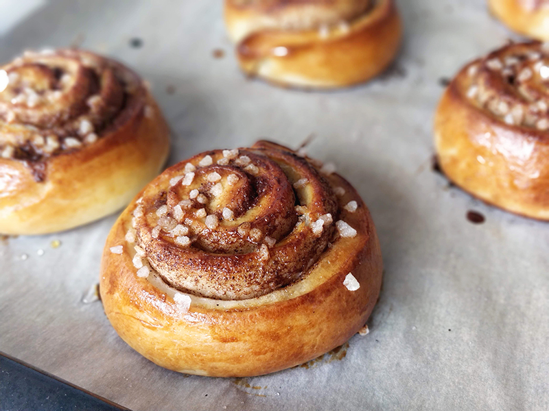

## Rollitos suecos de canela

**Ingredientes**

- 450 g de harina de trigo
- 250 ml de leche entera
- 75 g de mantequilla a temperatura ambiente
- 70 g de azúcar blanco
- 25 g de levadura fresca
- 2 tablespoons de cardamomo molido
- Una pizca de sal

*Para el relleno*

- 75 g de mantequilla a temperatura ambiente
- 45 g de azúcar blanco
- 1 tablespoon de canela molida

*Para la cobertura*

- 1 huevo batido
- Azúcar perlado
- 25 ml de agua
- 20 g de azúcar

**Preparación**

Empezaremos con la masa. Calentamos la mantequilla y la juntamos con la leche templada. Tiene que estar a unos 37 ºC.

Desmigamos la levadura en el bol de la KitchenAid (que estará equipada con el gancho), vertemos encima la leche y mezclamos bien. Añadimos el cardamomo, la sal y el azúcar. Poco a poco incorporamos la harina y mezclamos bien hasta que se integren todos los ingredientes, unos 10-12 minutos a velocidad baja hasta que la masa queda lisa y suave y no se pegue a las manos.

Pasamos la masa a un bol, tapamos con un paño y dejamos fermentar unos 30-40 minutos, o hasta que doble su tamaño.

Mientras, mezclamos los tres ingredientes del relleno. Mezclamos con un tenedor hasta que tengamos algo así como una masa cremosa. También podemos preparar el almíbar de la cobertura, calentando el agua, añadiendo el azúcar y removiendo hasta que se disuelva del todo. Reservamos.

Una vez pasado el tiempo de reposo, estiramos la masa con un rodillo intentando formar un rectángulo, de unos 2 milímetros de grosor. Extendemos el relleno de mantequilla (que non debe estar frío) sobre todo el rectángulo. Enrollamos la masa por el lado más largo apretando un poco para que no se abra demasiado en el horneado. Cortamos el rollo en trozos de unos 2 centímetros de grosor, y los vamos dejando en una bandeja de horno cubierta con papel de horno. Cuidaremos de no ponerlos muy juntos porque aumentan de tamaño. Cubrimos con un paño y dejamos fermentar unos 30 minutos.

Calentamos el horno a 200 ºC. Pintamos los rollitos con huevo batido y espolvoreamos con azúcar perlado. Horneamos unos 10-12 minutos o hasta que tengan un color dorado.

Sacamos del horno y pintamos con el almíbar.

**Notas**

He puesto la mitad de las cantidades de la receta original porque salen suficientes rollitos para comer y congelar. 
Si sois muchas personas o quieres llenar el congelador haz las cantidades originales, pero aún así, la masa total se dividirá en dos partes una vez amasada, y tendrás que realizar dos veces el formado de los rollitos (puedes verlo en el enlace de la receta original). Es más trabajo, pero tendrás rollitos por mucho más tiempo :D

Una vez horneados podemos congelarlos bien envueltos en papel film. Para descongelarlos podemos dejarlos a temperatura ambiente. Y si queremos, darle un golpe de calor en el horno o en el microondas.

**Receta de:** [El Comidista](https://elcomidista.elpais.com/elcomidista/2021/03/26/receta/1616778669_666536.html)