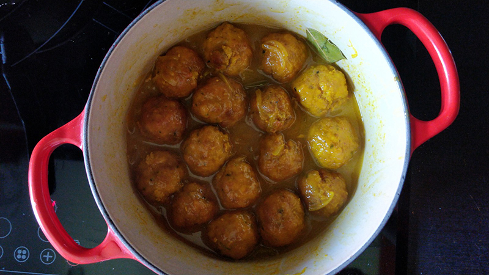

## Albóndigas	

**Ingredientes**

*Para las albóndigas*

- 1/2 kg de magro de cerdo picado
- Sal
- 2 dientes de ajo
- Perejil picado
- 1 huevo
- 2 rebanadas de pan de molde
- Leche
- Pan rallado
- Aceite de oliva

*Para la salsa*

- 2 o 3 dientes de ajo
- Media cebolla
- 1 hoja de laurel
- Medio vaso de vino blanco
- Medio vaso de agua
- Colorante (opcional)
- Sal

**Preparación**

Ponemos en un bol la carne picada y la sal. Picamos los ajos y el perejil en la picadora. Lo añadimos a la carne junto con el huevo, las dos rebanadas de pan bien empapadas en leche y amasamos. Si no liga muy bien, podemos añadir un poco de pan rallado. Si no podemos formar bien las albóndigas, podemos dejar enfriar la masa un poco en el frigorífico. 

Formamos las albóndigas, las pasamos por pan rallado y las freímos en una sartén con aceite de oliva. Las dejamos escurrir sobre papel absorbente para retirar el exceso de aceite.

El mismo aceite de haberlas frito, lo podemos utilizar para hacer la salsa. Si es mucho, cogemos solo una parte. Lo colamos a una olla y freímos los dientes de ajo en láminas y la cebolla picada o en juliana. Cuando el ajo empiece a dorarse, añadimos el laurel y las albóndigas, el vino blanco y el agua. Añadimos un poco de colorante si queremos y un poco de sal. Dejamos a fuego medio, removiendo con cuidado de no romper las albóndigas, hasta que se haga una salsa.

**Notas**

He utilizado tanto huevos M como L, en diferentes ocasiones, y no he notado diferencias. Puedes usar el que prefieras.

Podemos preparar las albóndigas con salsa de tomate. Para ello, preparamos las albóndigas de la misma forma y, ya fritas, las añadimos al tomate una vez hecho.

Si nos salen muchas albóndigas, podemos congelarlas después de pasarlas por el pan rallado, antes de freírlas.

Las albóndigas de choco (o sepia) se hacen igual, cambiando la carne por el choco picado. Pero utilizaremos harina en vez de pan rallado para el rebozado antes de freír.

**Receta de:** Mamá

