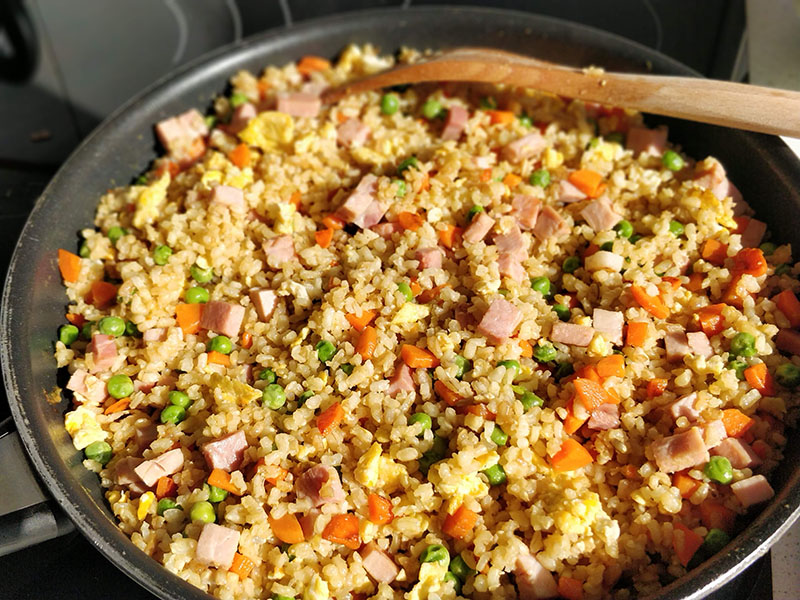

## Arroz chino tres delicias

**Ingredientes**

- 6 cucharaditas de aceite de oliva
- 150 g de arroz
- 350 ml de caldo de verduras o de agua 
- 2 zanahorias
- 70 g de guisantes 
- 2 huevos
- 1 cucharada de salsa de soja

**Preparación**

Haremos el arroz un día antes del que vayamos a comerlo, porque hay que dejarlo enfriar en la nevera.

Ponemos en un cazo dos cucharaditas de aceite a calentar y añadimos el arroz. Lo sofreímos un poco y añadimos el caldo de verduras o el agua. Cuando hierva, bajamos a fuego medio, tapamos y dejamos cocinar 12 minutos. Pasado el tiempo, lo apartamos a una fuente y dejamos enfriar a temperatura ambiente. Luego lo tapamos y lo dejamos en la nevera hasta que vayamos a utilizarlo.

Pelamos las zanahorias y las troceamos en dados. Las freímos en una sartén con dos cucharaditas de aceite a fuego medio durante 2 minutos. Añadimos los guisantes y freímos otros 5 minutos. Retiramos de la sartén y reservamos. 

En la misma sartén cascamos los huevos con un poquito de aceite (o sin añadir aceite, si vemos que no se va a pegar con lo que ya tiene) y con una espátula removemos, como si hiciéramos un revuelto. Cuando esté bien cuajado retiramos de la sartén y reservamos.

Por último, añadimos las dos últimas cucharaditas de aceite y cuando esté caliente, añadimos el arroz, la cucharada de salsa de soja, los huevos, las zanahorias y los guisantes. Removemos bien para que se mezcle todo y dejamos unos cinco minutos para que el arroz se caliente bien.

Lo probamos por si tenemos que añadir un poco de sal y listo.

**Notas**

Si utilizamos guisantes congelados, antes de echarlos a la sartén los cocemos y escurrimos.

En vez de cocer el arroz solo con agua, si no tenemos caldo, podemos añadir una pastilla de caldo concentrado de verduras.

También podemos añadirle dados de jamón cocido, pavo o gambas.

Para acompañar podemos utilizar la [salsa agridulce casera](../auxiliares/salsa-agridulce.md).

**Receta de:** Danza de fogones
