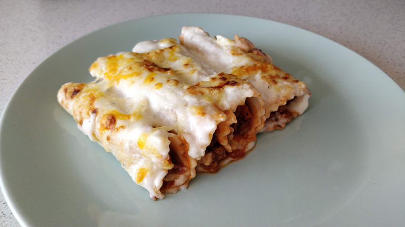

## Canelones

**Ingredientes**

- 20 placas de pasta para canelones

*Para el relleno*

- [Salsa boloñesa](../auxiliares/salsa-bolonesa.md)

*Para cubrir y gratinar*

- [Salsa bechamel](../auxiliares/salsa-bechamel.md)
- Queso parmesano, Grana Padano o Pecorino Romano

**Preparación**

Preparamos la [salsa boloñesa](../auxiliares/salsa-bolonesa.md).

Mientras se hace la boloñesa, preparamos la [salsa bechamel](../auxiliares/salsa-bechamel.md).

Para preparar la pasta ponemos una olla grande con 3/4 de la capacidad de agua. Ponemos al fuego y cuando hierva añadimos sal y vamos añadiendo las placas de canelones, una a una, con cuidado. Dejamos cocer el tiempo que indique el fabricante, removiendo de vez en cuando, con cuidado de no romperlas, para que no se peguen ni a la olla ni entre ellas. Cuando estén hechas, apartamos y las sacamos del agua con una espumadera. Las ponemos sobre un trapo limpio.

Preparamos una fuente apta para el horno engrasándola con mantequilla. Reservamos. Encendemos el horno a 250º C, con calor arriba y abajo.

Ponemos una cucharada de salsa boloñesa sobre cada placa de pasta, y enrollamos formando el canelón. Los vamos colocando uno al lado del otro en la fuente que teníamos preparada. Cuando tengamos la fuente completa de canelones, los cubrimos con salsa bechamel. Por último, añadimos el queso que tengamos rallado.

Introducimos en el centro del horno, hasta que el queso se dore.

**Notas**

Si nos sobran canelones los podemos congelar, tanto con la salsa bechamel como sin ella, una vez hechos en el horno o sin gratinar.

**Receta de:** Mamá
