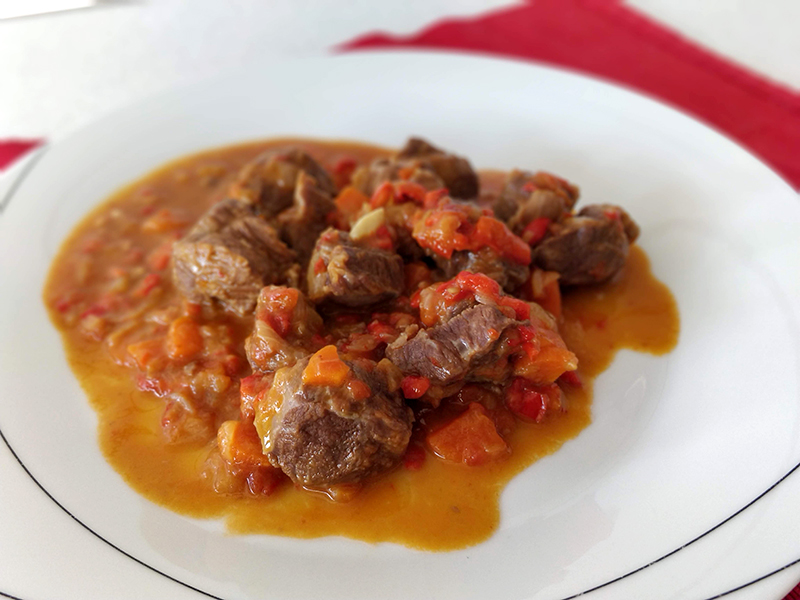

##Carrillera en salsa

**Ingredientes**

- 2 ñoras (o pimientos choriceros)
- 5 dientes de ajo
- 2 cebollas
- 1 pimiento rojo o 2 pequeños
- 1 vasito de aceite de oliva
- 2 zanahorias
- 4 tomates maduros
- 2 clavos
- 6 pimientas negra enteras
- 1 kg de carrillera limpia
- 1 vasito de vino blanco
- Agua
- Sal

**Preparación**

Le quitamos a las ñoras los rabitos y las semillas con cuidado. Luego las ponemos en un cazo con agua hirviendo, y las dejamos hasta que se ablanden. Escurrimos y las abrimos, y con la punta de un cuchillo le rascamos la carne. Reservamos.

Picamos los ajos, las cebollas, los pimientos y hacemos un sofrito con un poco de sal en una cacerola. Mientras pelamos y picamos las zanahorias y los tomates, y los añadimos al sofrito, junto con los clavos y la pimienta.

Cuando esté todo pochado, añadimos las carrilleras en tacos y la rehogamos un poco. Añadimos el vino y lo dejamos reducir. Añadimos lo que hayamos sacado de las ñoras a la cacerola y agregamos agua y un poco de sal. Dejamos hacer hasta que la carne esté tierna, removiendo de vez en cuando."

**Receta de:** Joaquín Martín
