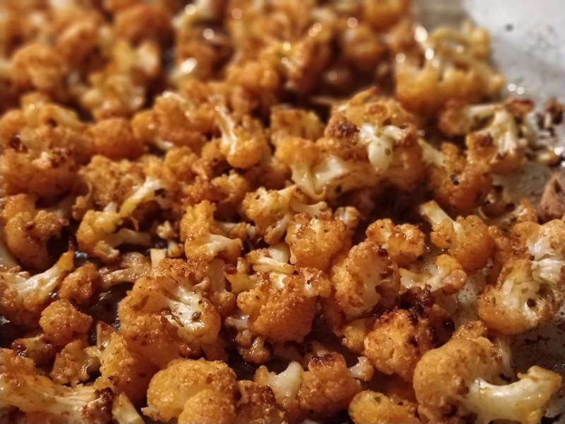

## Coliflor asada con pimentón y ajo

**Ingredientes**

- 1 coliflor
- 2-3 dientes de ajo, machacados
- Aceite de oliva
- 2 cucharaditas de pimentón de la vera
- Pimienta negra molida
- Sal
- Perejil fresco picado

*Ingredientes opcionales*

- Parmesano rallado
- Salsa de soja
- Otras especias aromáticas: comino, albahaca...
- El zumo de medio limón o media naranja
- Frutos secos

**Preparación**

Precalentamos el horno a 200º C.

Pelamos y quitamos las hojas verdes del tallo de la coliflor. La colocamos boca abajo y recortamos con un cuchillo la mayor parte del tronco central, hasta que los ramilletes comiencen a desprenderse solos. Limpiamos con agua los ramilletes y los secamos con un paño o un papel absorbente.

Ponemos los ramilletes en una bandeja apta para el horno y añadimos el resto de ingredientes. Removemos bien.

Horneamos en el centro durante unos 30 minutos, removiendo de vez en cuando para que se tueste por todos lados sin que se queme.

Servimos con perejil fresco, un poco de aceite, salsa de soja o lo que nos apetezca.

**Receta de:** [El restaurante del fin del mundo](http://restaurantefinmundo.blogspot.com.es/2015/03/coliflor-asada-con-pimenton-y-ajo-o.html)