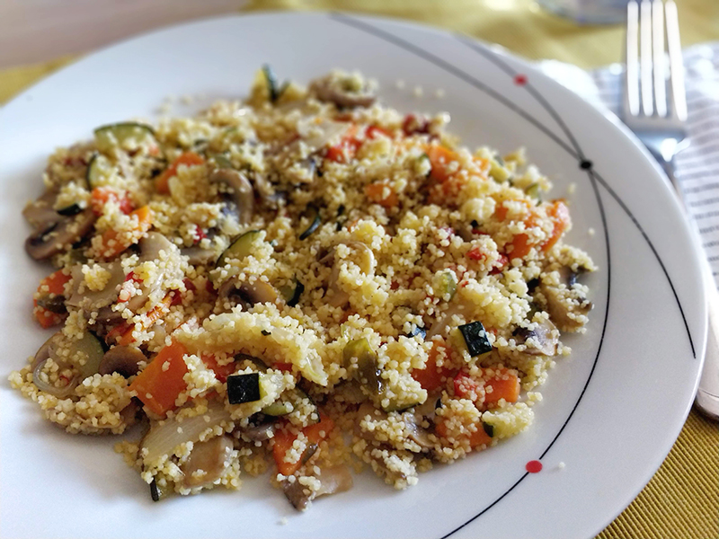

## Couscous o cuscús con verduras

**Ingredientes**

- Cebolla
- Pimiento verde
- Pimiento rojo
- Zanahoria
- Calabacín
- Brócoli
- Champiñones
- Ajo en polvo
- Sal
- Aceite de oliva
- Couscous
- Agua

**Preparación**

Picamos todas las verduras y vamos añadiendo a una sartén grande con aceite de oliva, para que se vayan pochando poco a poco. Añadimos un poco de sal y ajo en polvo a nuestro gusto.

Por otro lado preparamos el couscous como indique el fabricante. Cuando las verduras estén pochadas a nuestro gusto, mezclamos todo en la sartén y servimos.

**Notas**

Las cantidades y las verduras las podemos variar a nuestro gusto o a lo que tengamos disponible.

Si utilizamos brócoli es mejor tenerlo previamente cocido.

Si nos gusta que el sabor a ajo quede un poco más potente, podemos poner el ajo en polvo al final, o añadir ajo laminado al aceite del principio.

Podemos probar con otras especies que nos gusten y hacer diferentes combinaciones.

**Receta de:** Elena
