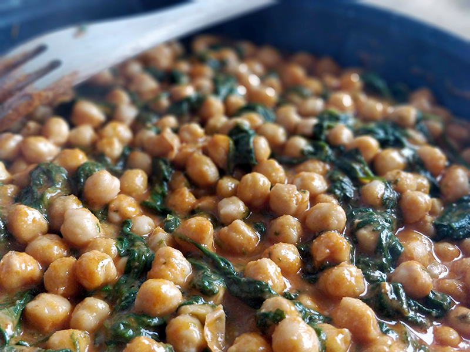

## Garbanzos con espinacas

**Ingredientes**

- 200 g de garbanzos
- Agua
- Sal
- 1 hoja de laurel
- 200 g de espinacas congeladas
- Aceite de oliva
- 5 dientes de ajo
- 5 o 6 rebanadas de pan
- Vinagre
- 2 cucharadas de salsa de tomate o tomate frito
- 1/2 cucharadita de comino molido
- Pimienta negra molida
- Cayena molida
- 1 cucharada de pimentón dulce 

**Preparación**

El día anterior ponemos los garbanzos en agua.

En la olla rápida ponemos los garbanzos enjuagados y escurridos. Cubrimos con agua y echamos un poco de sal. Si queremos ponemos también la hoja de laurel. Cerramos la olla y dejamos que se pongan tiernos, unos 20 minutos. Escurrimos y reservamos.

Cocemos las espinacas en agua hirviendo con sal, unos 8 minutos, o según indique el fabricante. Escurrimos y reservamos.

En una sartén con aceite de oliva freímos dos dientes de ajo, laminados o enteros, y reservamos.

Cortamos el pan en rebanadas y freímos también en la sartén con aceite. Apartamos a un plato con papel absorbente para retirar el exceso de aceite.

En el vaso de la batidora ponemos un poco de vinagre, la salsa de tomate, el comino, el pan, los ajos fritos, un poco de pimienta y un poco de cayena. Añadimos agua para triturarlo todo. Debe quedar más bien líquido. Podemos ir añadiendo agua poco a poco hasta que tenga la consistencia que queremos. Reservamos.

Ponemos la sartén al fuego con un poco de aceite de oliva y doramos tres dientes de ajo enteros. Añadimos las espinacas escurridas y rehogamos. Añadimos el pimentón, removemos bien y añadimos el batido. Añadimos los garbanzos, rectificamos de sal, pimienta y vinagre y dejamos cocer hasta que espese.

**Notas**

Si tenemos espinacas frescas usaremos 2 o 3 manojos. Las lavamos, las cortamos y las ponemos a cocer en una cacerola con un poco de sal, unos 7 minutos. Las escurrimos y reservamos.

Podemos reservar agua de la cocción de los garbanzos o de las espinacas para añadírsela al batido.

**Receta de:** [Las recetas de Triana](http://www.lasrecetasdetriana.com/2013/02/espinacas-con-garbanzos-en-triana.html)