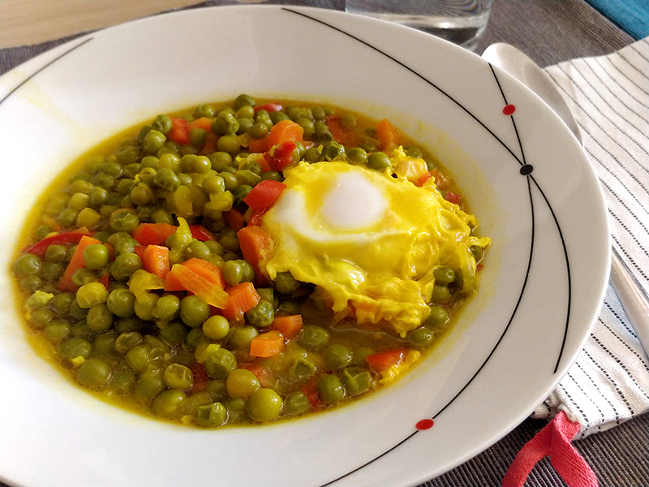

## Guisantes con huevo

**Ingredientes**

- Media cebolla
- 2 dientes de ajo
- Medio pimiento verde
- Unas rodajas de pimiento rojo
- 1 o 2 zanahorias
- Aceite de oliva
- 500 g de guisantes congelados
- Sal
- 1 hoja de laurel
- Colorante
- Agua
- 2 huevos (uno por persona)

**Preparación**

Picamos la cebolla, los dientes de ajo, los pimientos y la zanahorias peladas. En una olla ponemos una capa finita de aceite y pochamos todas las verduras.

Añadimos los guisantes (no hace falta descongelarlos), la sal, la hoja de laurel y el colorante, y cubrimos de agua. Ponemos al fuego, tapando la olla, hasta que los guisantes se pongan tiernos. Si vemos que se va quedando seco, añadimos más agua, para que quede caldo.

Una vez tiernos los guisantes, añadimos los huevos y dejamos que cuajen, tapando la olla de nuevo.

**Notas**

Si queremos, en el momento de añadir las verduras, podemos añadir taquitos de jamón serrano.

**Receta de:** Mamá