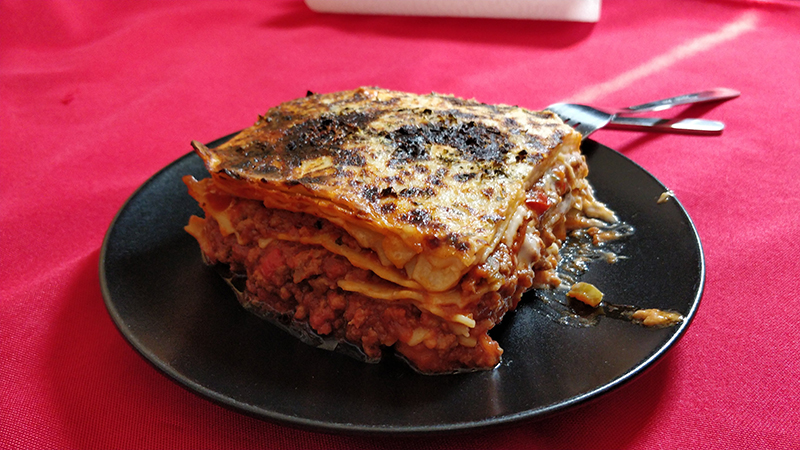

## Lasaña

**Ingredientes**

- 10-15 placas de lasaña
- Agua
- Sal

*Para el relleno*

- [Salsa boloñesa](../auxiliares/salsa-bolonesa.md)

*Para cubrir y gratinar*

- [Salsa bechamel](../auxiliares/salsa-bechamel.md)
- Queso parmesano, Grana Padano o Pecorino Romano rallado
- Orégano
- Albahaca

**Preparación**

Preparamos la [salsa boloñesa](../auxiliares/salsa-bolonesa.md).

Preparamos la [salsa bechamel](../auxiliares/salsa-bechamel.md).

Para preparar la pasta ponemos una olla grande con 3/4 de la capacidad de agua. Ponemos al fuego y cuando hierva añadimos sal y vamos añadiendo las placas de lasaña, una a una, con cuidado. Dejamos cocer el tiempo que indique el fabricante, removiendo de vez en cuando, con cuidado de no romperlas, para que no se peguen ni a la olla ni entre ellas. Cuando estén hechas, apartamos y las sacamos del agua con una espumadera. Las ponemos sobre un trapo limpio.

Precalentamos el horno a 250º C, con calor por arriba y abajo. Ponemos una bandeja a una altura por debajo del centro.

Preparamos una fuente para montar la lasaña. Engrasamos la base con un poco de mantequilla o ponemos un poco de salsa bechamel. Formamos una base con placas de lasaña, añadimos unas cucharadas de salsa boloñesa, unas cucharadas de bechamel, queso rallado y un poco de orégano y albahaca. Repetimos el proceso hasta que tengamos como última capa placas de lasaña o salsa boloñesa. Para terminar añadimos el resto de la salsa bechamel, abundante queso rallado, orégano y albahaca.

Llevamos al horno hasta que cuaje un poco y el queso esté dorado.

**Receta de:** Mamá