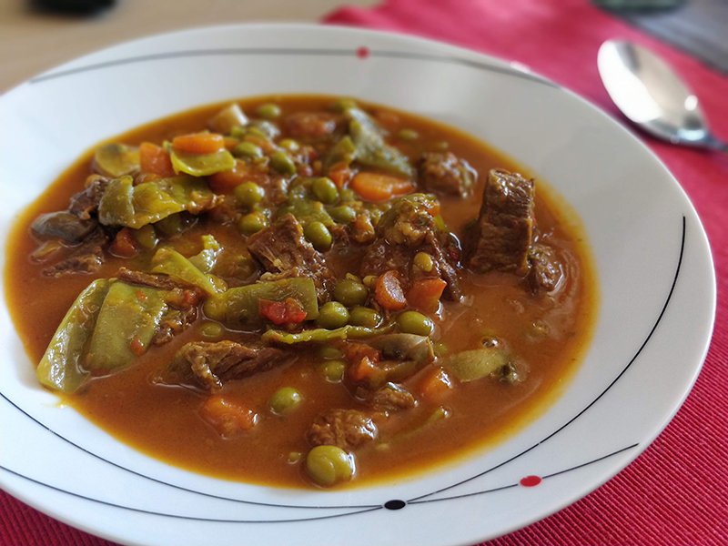

## Magro de cerdo guisado con verduras

**Ingredientes**

- Un trozo de pimiento rojo
- 1 pimiento verde
- 1/2 cebolla o un puerro
- 1 diente de ajo
- 2 tomates maduros
- 1 o 2 zanahorias
- Aceite de oliva
- 500 g de magro de cerdo en tacos
- Sal
- Colorante
- 1/2 cucharadita de pimentón dulce
- 1 hoja de laurel
- Perejil
- Medio vaso de vino blanco
- 1/4 kg de habichuelas verdes
- 150 g de guisantes congelados

**Preparación**

Picamos todas las verduras y reservamos.

Ponemos una capa fina de aceite en la olla rápida y calentamos a fuego medio-alto. Añadimos la carne limpia y sal. Removemos. Incorporamos toda la verdura picada. Agregamos el colorante, el pimentón, la hoja de laurel, el perejil y el vino blanco. Removemos para que se mezcle todo y dejamos que se evapore un poco el alcohol. Añadimos agua hasta que lo cubra todo, la suficiente para que cueza unos 14 minutos. Podemos echarle menos e ir apartando la olla y mirando para que no se quede seco, pues se quemaría. Mientras, pelamos las habichuelas verdes y las cortamos en trozos. Pasado el tiempo, apartamos la olla y dejamos salir la presión. Añadimos las habichuelas verdes, comprobando que tenga suficiente agua aún o ajustando si es necesario. Volvemos a cerrar la olla y dejamos que cueza unos 6 minutos más.

Pasado el tiempo apartamos la olla, dejamos salir la presión y comprobamos si la carne está tierna. Si le falta un poco volvemos a ponerla al fuego, comprobando que quede líquido o añadiendo más agua si la necesitara, pero ya destapada. Si ya está tierna, añadimos los guisantes y mezclamos. Si tiene suficiente agua para que se hagan lo dejamos así, y si hay poca, añadimos un poco más. Dejamos que cueza hasta que se pongan tiernos, con la olla destapada.

**Notas**

Podemos cambiar el magro de cerdo por magro de ternera.

Podemos añadir champiñones, más zanahorias o cualquier otra verdura que nos guste, ajustando los tiempos de cocción para que no queden duras ni pasadas.

**Receta de:** Mamá