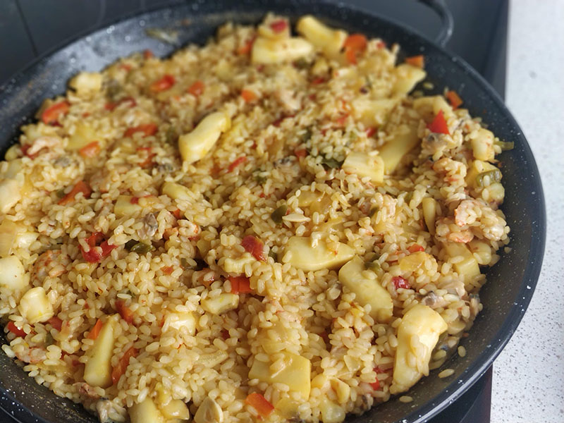

## Paella

**Ingredientes**

- 250 g de almejas
- Agua
- 1 choco o sepia
- 250 g de gambas arroceras
- Media cebolla
- 2 o 3 dientes de ajo
- Medio pimiento verde
- Un trozo de pimiento rojo
- 2 tomates maduros
- Aceite de oliva
- Azafrán en hebra
- Colorante
- Vino blanco
- 1 hoja de laurel
- Arroz
- Sal

**Preparación**

Cocemos las almejas en un cazo con poca agua. En el momento en que estén abiertas retiramos del fuego. Colamos el agua y la reservamos. Desechamos las cáscaras de las almejas y reservamos la carne.

Limpiamos el choco y lo cortamos en tiras o trozos. Reservamos.

Pelamos las gambas y ponemos en un cazo con agua las cabezas y las cáscaras, y lo ponemos a cocer. Colamos el agua y la reservamos.

Picamos la cebolla, los ajos y los pimientos y los tomates y hacemos un sofrito en una sartén con aceite. Añadimos el choco, que es más duro, el azafrán, colorante, el vino blanco y la hoja de laurel. Cuando el choco esté tierno añadimos las gambas y a continuación el arroz y el agua que teníamos reservada, echando el doble de la cantidad de arroz, y sal. Dejamos que se ponga tierno el arroz y, cuando esté casi a punto, añadimos las almejas, apartamos y dejamos reposar cinco minutos antes de servir.

**Receta de:** Mamá