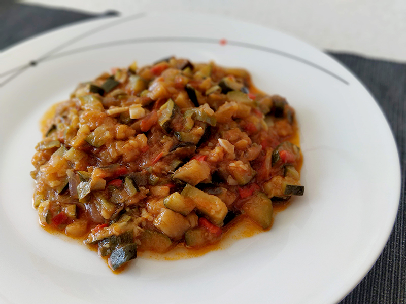

## Pisto

**Ingredientes**

- Aceite de oliva
- Media cebolla
- Un trozo de pimiento rojo
- Medio pimiento verde
- 1 diente de ajo
- 1 puerro (opcional)
- 3 calabacines
- 1 berenjena
- Sal
- Un poco de tomate frito

**Preparación**

En una olla con una capa finita de aceite hacemos un sofrito con la cebolla, los pimientos y el ajo, y puerro si tenemos. Mientras, pelamos y picamos el calabacín y la berenjena en taquitos. Cuando los pimientos y la cebolla estén tiernos, añadimos los calabacines y la berenjena, y un poco de sal. Removemos y tapamos.

Ponemos a fuego lento y removemos de vez en cuando para que no se pegue. Cuando la verdura esté tierna, podemos añadir un poco de tomate frito, para darle un poco más de color y sabor. Mezclamos bien y apartamos.

**Notas**

Podemos hacer bastante cantidad y congelar lo que no vayamos a comer, para otro día.

Se suele acompañar con un huevo frito o algún embutido.

**Receta de:** Mamá
