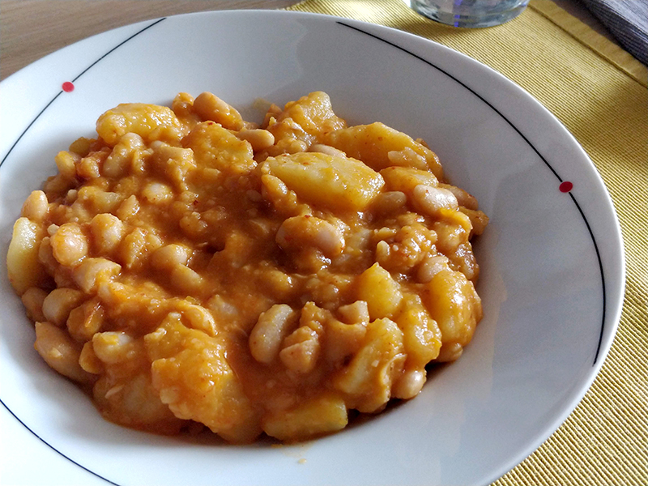

## Potaje de habichuelas blancas

**Ingredientes**

- 2 tazas de habichuelas blancas
- 2 dientes de ajo
- 1 zanahoria
- Media cebolla
- 1 patata
- 1 vasito de aceite de oliva
- Un trozo de pimiento rojo
- 1 cucharadita de pimentón dulce
- 1 hoja de laurel
- 1 chorizo
- Sal
- Agua para cubrirlo todo

**Preparación**

La noche anterior ponemos las habichuelas en agua.

Pelamos los ajos, la zanahoria y la cebolla. Pelar también la patata y la cortamos en trozos. La reservamos en agua.

En una cacerola ponemos todos los ingredientes en crudo menos la patata. Añadimos un poco de sal y cubrimos de agua. Tapamos y ponemos a fuego alto hasta que empiece a hervir. Bajamos a fuego medio.

Vigilamos que no se quede seco, añadiremos agua cuando lo necesite, pero sin echar mucha de golpe, mejor pequeñas cantidades.

Cuando las habichuelas empiecen a agrietarse un poco, añadiremos la patata escurrida que teníamos reservada. Dejamos que se termine de hacer, para que la patata se ponga tierna.

**Notas**

Podemos majar un diente de ajo con un poco de comino y añadirlo junto con la patata.

En vez de chorizo, podemos añadir unos trozos de calabaza.

**Receta de:** Mamá
