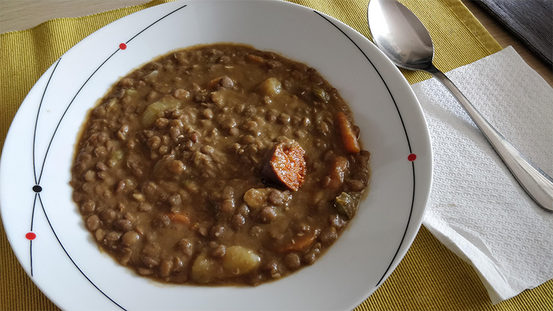

## Potaje de lentejas

**Ingredientes**

- 1 patata
- Media cebolla
- 1 zanahoria
- 1 o 2 dientes de ajo
- 1 trozo de pimiento verde y/o un trozo de pimiento rojo
- 2 tazas de lentejas
- 1 vasito de aceite de oliva
- 1 cucharadita de pimentón dulce
- 1 hoja de laurel
- 1 chorizo
- Sal
- Agua para cubrirlo todo

**Preparación**

Pelamos y troceamos la patata y reservamos en agua. Pelamos la cebolla, la zanahoria y los dientes de ajo. Lavamos y secamos los pimientos.

Ponemos todos los ingredientes menos la patata, en una cacerola, en crudo. Añadimos un poco de sal y cubrimos de agua. La zanahoria la añadimos en trozos o entera, como queramos. Tapamos y ponemos a hervir. Cuando hierva bajamos a fuego medio. Cuando lleve unos quince minutos hirviendo, escurrimos la patata y la añadimos. Si vemos que las lentejas se están quedando secas, añadimos más agua y volvemos a tapar. Dejamos cocinar hasta que las lentejas, las zanahorias y la patata se pongan tiernas. Probamos de sal y corregimos si es necesario.

**Notas**

Si cuando las lentejas están tiernas, aún tienen mucho caldo y queremos que espese, añadimos un chorrito de tomate frito, removemos y dejamos hervir un poco.

En vez de chorizo podemos añadir trozos de calabaza, para que sean unas lentejas con menos grasa.

**Receta de:** Mamá