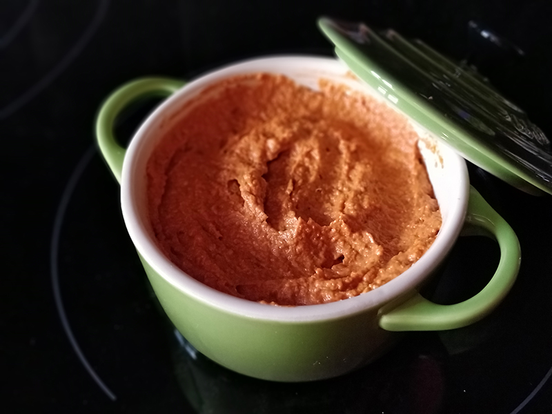

## Sobrasada vegana

**Ingredientes**

- 100 g de tomates secos
- Agua caliente
- 1 diente de ajo
- 30 g de piñones
- 1/2 cucharadita de pimentón dulce
- 1/3 cucharadita de pimentón picante
- Una pizca de pimienta negra
- 2 cucharadas de aceite de oliva virgen extra
- 1/2 cucharadita de sal

**Preparación**

Ponemos a remojar en agua caliente los tomates secos durante 15 minutos para hidratarlos. Mientras, ponemos en el vaso de la batidora los ajos, el pimentón dulce, el pimentón picante, la pimienta, la sal y el aceite.

Cuando los tomates estés hidratados, los escurrimos, los echamos junto con el resto de ingredientes y lo batimos todo bien hasta conseguir una textura untuosa pero grumosa.

Una vez tengamos lista la sobrasada, podemos consumirla tal cual o meterla en la nevera unos minutos para que se refrigere un poco.

**Notas**

En caso de que los tomates secos vengan en aceite, no será necesario hidratarlos. Además, si ya llevan sal, tened en cuenta que la cantidad que habrá que añadir de ésta será menor.

Si notáis que a la hora de batir os cuenta un poco, podéis echar una cucharada más de aceite.

Esta sobrasada es perfecta para tomarla untada en tostadas o crackers, para dipear con bastoncitos o incluso para añadirla en pizzas.

**Receta de:** [Vegamecum](https://vegamecum.com/2016/10/07/sobrasada-vegana/)